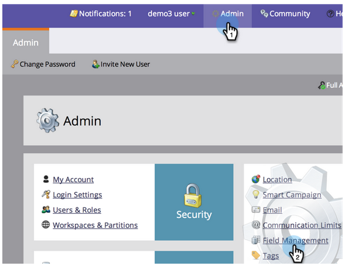
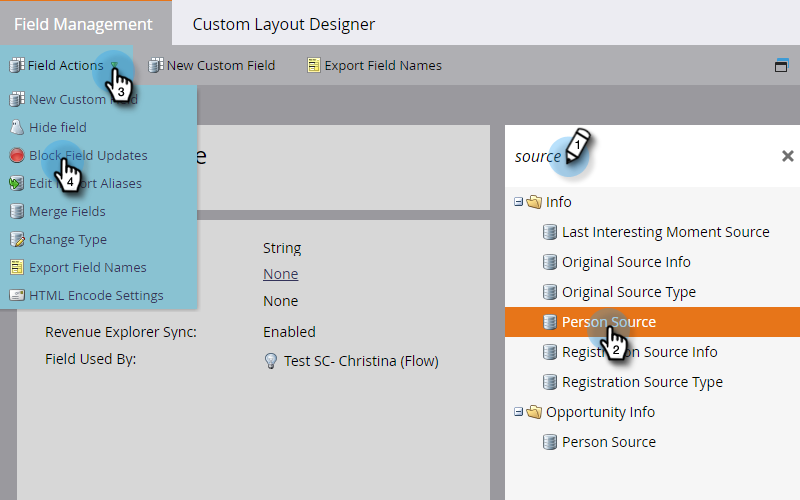

# Block Updates to a Field {#block-updates-to-a-field}

Block Updates to a Field - Marketo Docs - Product Documentation

Blocking updates to a field allows you to write to the field once and then retain the original value for the lifetime of the field. This can be useful for a field like Person Source.

>[!NOTE]
>
>**Admin Permissions Required**

1. Go to **Admin** and click **Field Management**.

   

1. Find the field, select it, then under **Field Actions**, click **Block Field Updates**.

   

1. Select the **Input Sources** you want to block and click **Apply**.

   

   >[!CAUTION]
   >
   >When performing a list import, the status of a field being blocked in the Import Preview will only show if the field is automatically recognized by Marketo based on the name of the field matching **exactly** (or if aliases are established). If the field is manually chosen from the Marketo Field drop-down, the blocked status will not show in the Import Preview, but update-blocking to that field will still be implemented.

