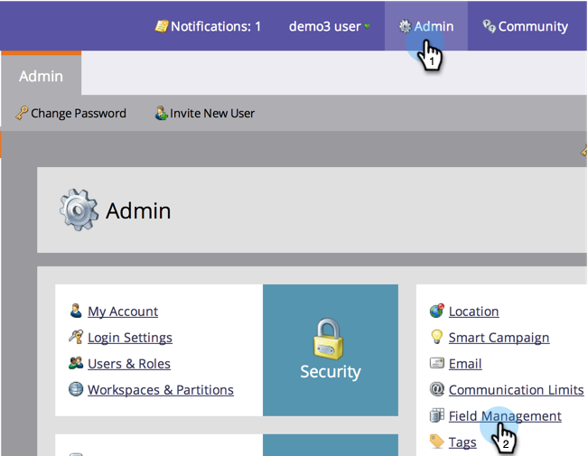
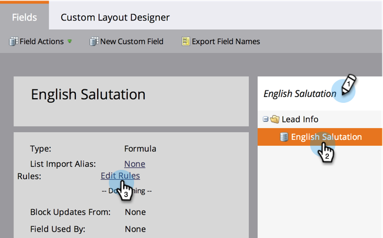

# Create and Use a Concatenated String (Formula) Field {#create-and-use-a-concatenated-string-formula-field}

Create and Use a Concatenated String (Formula) Field - Marketo Docs - Product Documentation

You can combine values from multiple fields or build a conditional value using a Marketo Formula field.

1. Go to **Admin** and click **Field Management**.

   

1. Click **New Custom Field**.

   

1. Select **Formula** for the **Type**.

   

1. Enter a **Name** for your field then click **Create**.

   

1. Find and select your formula field then click **Edit Rules**.

   

1. Add two choices and define them like the screenshot below.

   

   Learn more about [tokens for flow steps](../../../../welcome-to-marketo-docs/product-docs/core-marketo-concepts/smart-campaigns/flow-actions/use-tokens-in-flow-steps.md).

1. Now you can add the formula field as a token in an email.

   

Good work! Now you have a smart field that knows what salutation to include based on gender. Have fun with this and get creative.

>[!NOTE]
>
>Formula fields can be used in landing pages, emails and smart list columns; they are not exported. Emails with formula fields cannot be sent via batch campaigns

