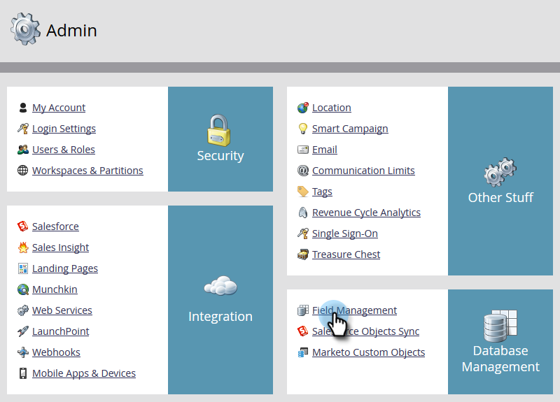

# HTML Encode Tokens in Emails {#html-encode-tokens-in-emails}

HTML Encode Tokens in Emails - Marketo Docs - Product Documentation

Enable/disable person and company tokens used in emails.

>[!NOTE]
>
>**Admin Permissions Required**

>[!NOTE]
>
>**Definition**
>
>Encoding converts characters into their HTML code versions to prevent confusion when being transmitted (i.e. "&" is changed to "&amp;"). For more details, please consult your web developer.

1. Go to **Admin**.

   

1. Select **Field Management**.

   

1. Find and select your desired field.

   

1. Check the **HTML Encode Tokens in Emails** box to enable, uncheck to disable.

   

   And that's it! You can do that for as many individual fields as you want.

