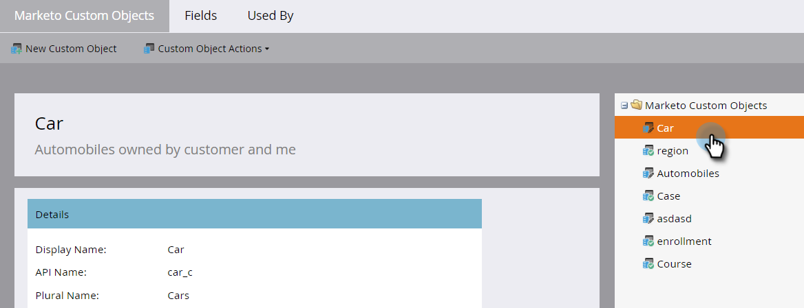
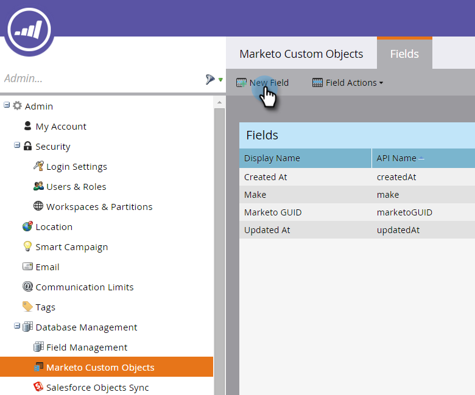
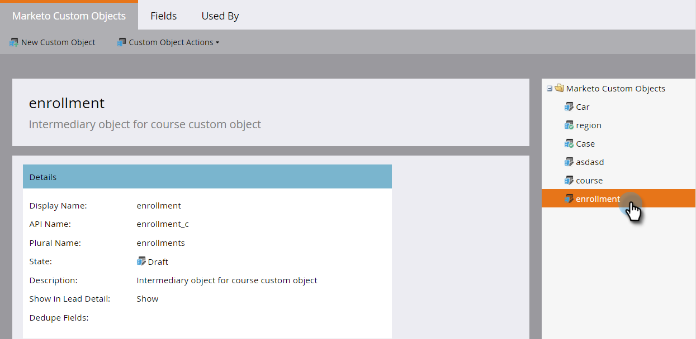
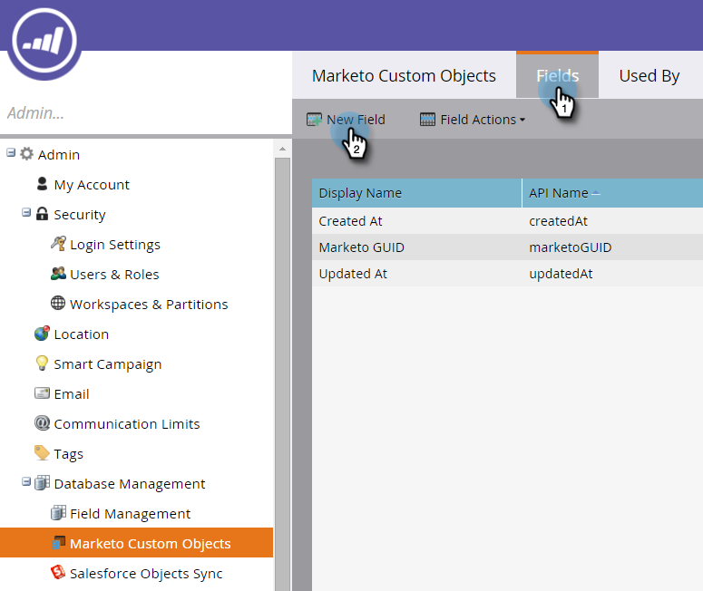
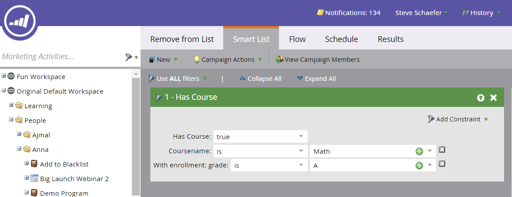

# Add Marketo Custom Object Link Fields {#add-marketo-custom-object-link-fields}

Add Marketo Custom Object Link Fields - Marketo Docs - Product Documentation

When you create custom objects, you must provide link fields to connect the custom object record to the correct parent record.

* For a one-to-many custom structure, use the link field in the custom object to connect it to a person or a company.
* For a many-to-many structure, you use two link fields, connected from a separately created intermediary object (which is a type of custom object, too). One link connects to people or companies in your database and the other connects to the custom object. In this case, the link field is not located in the custom object itself.

### What's in this article? {#what-s-in-this-article}

[Create a Link Field for a One-to-Many Structure](#addmarketocustomobjectlinkfields-createalinkfieldforaone-to-manystructure)  
[Create a Link Field for a Many-to-Many Structure](#addmarketocustomobjectlinkfields-createalinkfieldforamany-to-manystructure)  
[Using Custom Objects](#addmarketocustomobjectlinkfields-usingcustomobjects)

#### Create a Link Field for a One-to-Many Structure {#addmarketocustomobjectlinkfields-createalinkfieldforaone-to-manystructure}

Here's how to create a link field in a custom object for a one-to-many structure.

1. Click **Admin**, and in **Database Management**, select **Marketo Custom Objects**.

   

1. Select the custom object in the list.

   

1. In the **Fields** tab, click **New Field**.

   

1. Name the link field and add an optional description. Be sure to select the Link data type.

   

   >[!CAUTION]
   >
   >You won't be able to go back and create, edit, or delete a Link or Dedupe Field once the custom object is approved.

1. Select whether the link object is for a lead (person) or a company.

   

   >[!NOTE]
   >
   >If you choose lead, you'll see Id, email Address, and any custom fields in the list.
   >
   >
   >If you choose company, you'll see Id and any custom fields in the list.

1. Select the link field you want to connect to as the parent of the new field.

   

   >[!NOTE]
   >
   >Only string field types are supported in the link field.

1. Click **Save.**

   

#### Create a Link Field for a Many-to-Many Structure {#addmarketocustomobjectlinkfields-createalinkfieldforamany-to-manystructure}

Here's how to create a link field in an intermediary object for use in a many-to-many structure.

>[!NOTE]
>
>**Prerequisites**
>
>You must have already created the intermediary object and any custom objects you intend to link it to.

1. Click **Admin**, and in **Database Management**, select **Marketo Custom Objects**.

   

1. Select the intermediary object you want to add the field to.

   

1. In the **Fields **tab, click **New Field**.

   

1. You need to create two link fields. Create them one at a time. First, name the field for the members of your database list (leadID, for example). Add an optional description. Be sure to select the link data type.

   

   >[!CAUTION]
   >
   >You won't be able to go back and create, edit, or delete a Link or Dedupe Field once the custom object is approved.

1. Select the link object from your database, in this case Lead.

   

1. Select the link field you want to connect to, in this case, Id.

   

   >[!NOTE]
   >
   >Only string field types are supported in the link field.

1. Click **Save.**

   

1. Repeat this process for the second link to your custom object, in this example, courseID. The Link Object Name will be course, and the Link Field will be courseID. Since you already created and approved the course custom object, these selections are available in the drop-down menus.

   

1. Create any other fields that you want to use in your intermediary object, such as enrollmentID or grade.

   #### Using Custom Objects {#addmarketocustomobjectlinkfields-usingcustomobjects}

   The next step is to use these custom objects in filters in your smart campaigns. With a many-to-many relationship, you can select multiple people/companies and multiple custom objects. In the example below, anyone in your database who matches these criteria will be listed. The coursename field comes from the course custom object and the enrollment grade comes from the intermediate object.

   

>[!NOTE]
>
>**Related Articles**
>
>* [Add Marketo Custom Object Fields](add-marketo-custom-object-fields.md)
>* [Edit and Delete a Marketo Custom Object](edit-and-delete-a-marketo-custom-object.md)
>* [Understanding Marketo Custom Objects](understanding-marketo-custom-objects.md)
>* [Edit and Delete Marketo Custom Object Fields](edit-and-delete-marketo-custom-object-fields.md)
>

&nbsp; 