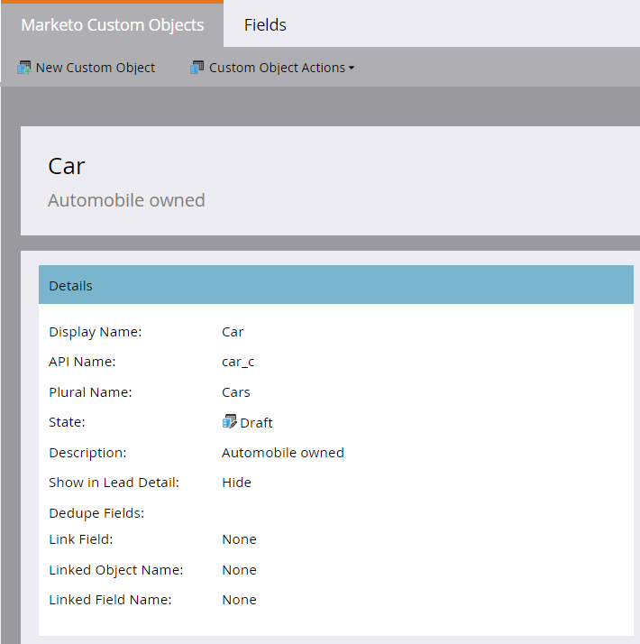
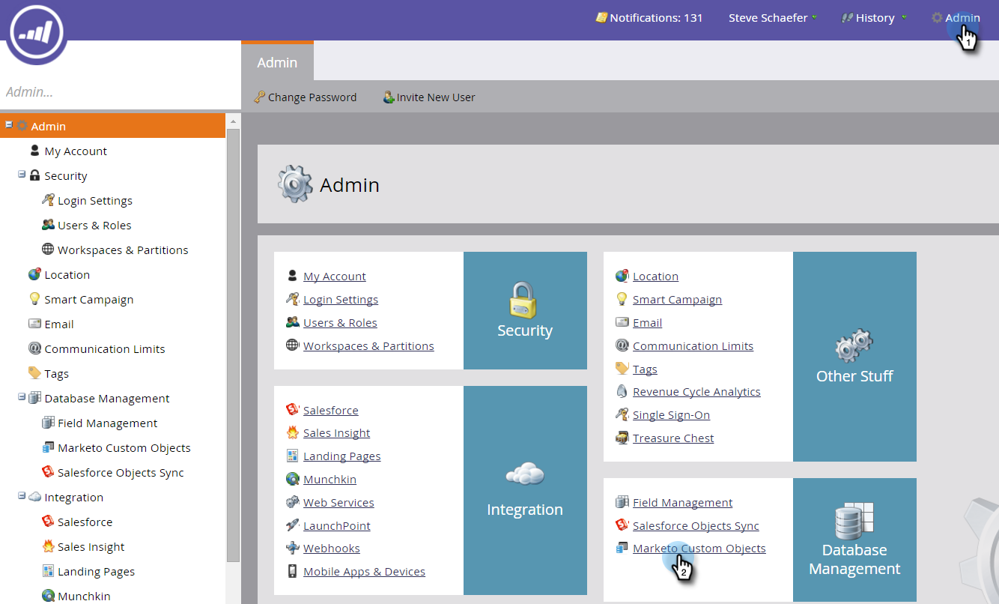
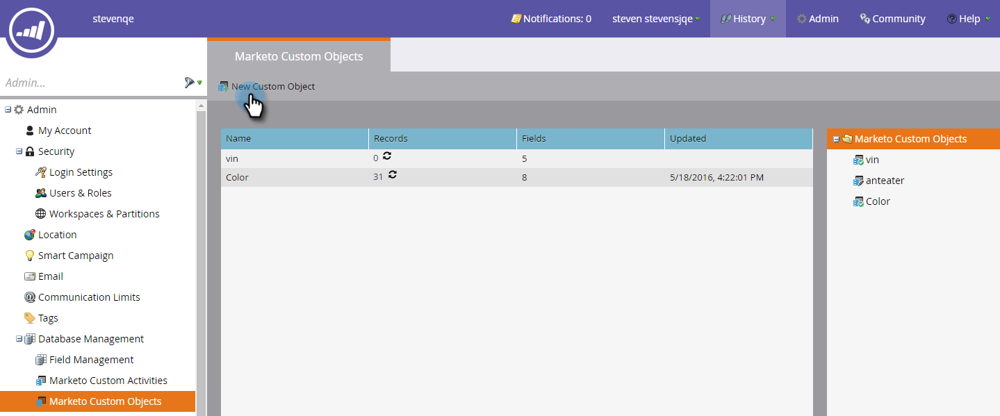

# Create Marketo Custom Objects {#create-marketo-custom-objects}

Create Marketo Custom Objects - Marketo Docs - Product Documentation

Use custom objects in Marketo to track metrics specific to your business. This could be anything from cars, to courses–-whatever you would like to model in Marketo to run your campaigns.

>[!NOTE]
>
>You can set up custom objects to work on a one-to-many or many-to-many basis. You create the initial object the same way, but the steps are different when you start adding fields to the object. See [Understanding Marketo Custom Objects](understanding-marketo-custom-objects.md) for more information.

### What's in this article? {#what-s-in-this-article}

[Create a Custom Object for a One-to-Many Structure](#createmarketocustomobjects-createacustomobjectforaone-to-manystructure)  
[Create a Custom Object for a Many-to-Many Structure](#createmarketocustomobjects-createacustomobjectforamany-to-manystructure)  
[Create an Intermediary Object](#createmarketocustomobjects-createanintermediaryobject)

>[!NOTE]
>
>You cannot create, edit, or delete a Link or Dedupe Field once the custom object is approved.

#### Create a Custom Object for a One-to-Many Structure {#createmarketocustomobjects-createacustomobjectforaone-to-manystructure}

This example shows a Car custom object, for use in a one-to-many structure. Later, you'll create a course custom object and an intermediary object to use in a many-to-many structure.

1. Click **Admin**, and in **Database Management** select **Marketo Custom Objects**.

   ** 

   **

1. Click **New Custom Object**.

   

   >[!NOTE]
   >
   >The Marketo Custom Objects tab displays all custom objects on the right, and details for any approved ones, including number of records and fields at the most recent update.

1. Enter a display name. The API Name and Plural Name populate automatically. Enter a description (optional).

   

   >[!NOTE]
   >
   >You can edit these fields when you're creating them, but after they're saved, you can only edit the Plural Name field and the **Show in Lead Detail** slider.

1. Pull the **Show in Lead Detail **slider over to display **Show** if you want to view custom object data on the Lead Database page. Click **Save**.

   

1. The custom object information displays the content you entered. Notice that it's in a Draft state.

   

   The next step is to add fields to [build out your custom object](add-marketo-custom-object-fields.md).

   >[!NOTE]
   >
   >You can only populate Marketo Custom Objects via a list import, or the [API](http://developers.marketo.com/documentation/rest/).

#### Create a Custom Object for a Many-to-Many Structure {#createmarketocustomobjects-createacustomobjectforamany-to-manystructure}

This example shows a course custom object, which you'll use for creating a many-to-many relationship between people/companies and courses. When you're done, you'll create an intermediary object to connect it to people or companies in your database.

>[!NOTE]
>
>For a many-to-many relationship, you don't need to create a link in the custom object. Instead, you'll add two links to the intermediary object (see below).

1. Click **Admin**, and in **Database Management** select **Marketo Custom Objects**.

   

1. Click **New Custom Object**.

   

1. Enter a display name. The API Name and Plural Name populate automatically. Enter a description (optional).

   

   >[!NOTE]
   >
   >You can edit these fields when you're creating them, but after they're saved, you can only edit the Plural Name field and the **Show in Lead Detail** slider.

1. Pull the **Show in Lead Detail **slider over to display Show if you want to view custom object data on the Lead Database page. Click **Save**.

   

1. The custom object information displays the content you entered. Notice that it's in a Draft state.

   

   >[!NOTE]
   >
   >You can only populate Marketo Custom Objects via a list import, or the [API](http://developers.marketo.com/documentation/rest/).

The next step is for you create your intermediary object (see below). But before that, you need to create a field to link to with it.

#### Create an Intermediary Object {#createmarketocustomobjects-createanintermediaryobject}

Use an intermediary object to connect a custom object to people or companies. In this example, it's used to connect courses in your course custom object to people or companies in your database.

>[!NOTE]
>
>You don't need to create an intermediary object for a one-to-many custom object structure.

1. Click **Admin**, and in **Database Management**, select **Marketo Custom Objects**.

   

1. Click **New Custom Object**.

   

1. Enter a display name. The API Name and Plural Name populate automatically. Enter a description (optional).

   

   >[!NOTE]
   >
   >You can edit these fields when you're creating them, but after they're saved, you can only edit the Plural Name field and the Show in Lead Detail slider.

1. Pull the **Show in Lead Detail** slider over to display Show if you want to view custom object data on the Lead Database page. Click **Save**.

   

1. The custom object information displays the content you entered. Notice that it's in a Draft state.

   The next step is for you to [add link fields](add-marketo-custom-object-link-fields.md) to connect your intermediary object to a person/company and a custom object.

>[!NOTE]
>
>**Related Articles**
>
>* [Add Marketo Custom Object Fields](add-marketo-custom-object-fields.md)
>* [Add Marketo Custom Object Link Fields](add-marketo-custom-object-link-fields.md)
>* [Understanding Marketo Custom Objects](understanding-marketo-custom-objects.md)
>

