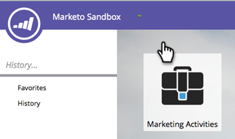
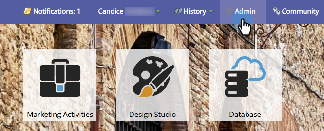
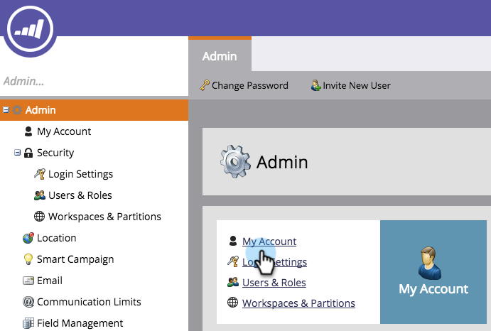

# Edit Subscription Settings {#edit-subscription-settings}

Edit Subscription Settings - Marketo Docs - Product Documentation

If you have access to multiple Marketo subscriptions and want to be sure which one you're using, try giving each one a unique name. That name then displays at the top of your subscription page.

For example, if you work in both production and sandbox instances, you can name one subscription **Marketo Production** and the other **Marketo Sandbox**.

1. Go to **Admin**.

   

1. Click **My Account**.

   

1. Click **Edit Subscription Information**.

   

1. Make your edits and click **Save**.

   

   Ta-da! Your subscription has a new name.

