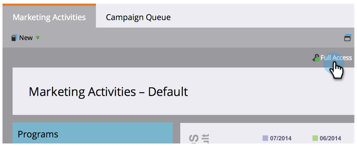

# Find Out What Permissions You Have {#find-out-what-permissions-you-have}

Find Out What Permissions You Have - Marketo Docs - Product Documentation

If you're wondering what permissions you have or don't have in Marketo, there's an easy way for you to find out.

1. Go to** Marketing Activities**.

   

1. Click **Full Access** to see the permissions you have.

   

1. You will see the permissions like so.

   

   If you need any of the permissions enabled for you, speak to your Marketo administrator.

