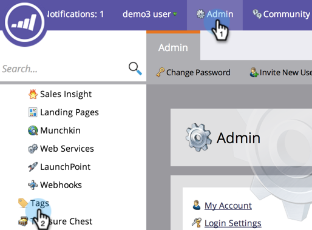
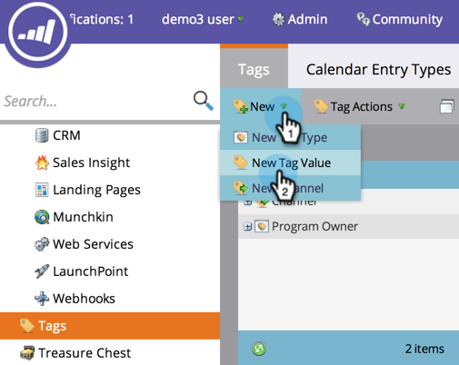
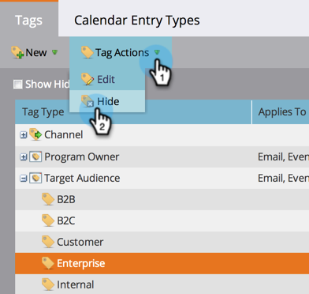
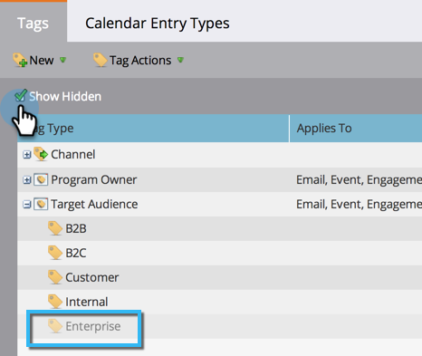

# Managing Tag Values {#managing-tag-values}

Managing Tag Values - Marketo Docs - Product Documentation

[Tags](../../../../welcome-to-marketo-docs/product-docs/core-marketo-concepts/programs/working-with-programs/understanding-tags.md) are used to describe programs. You can make as many as you need, each with unique values. Here's how to manage those values.

>[!NOTE]
>
>**Admin Permissions Required**

>[!NOTE]
>
>**Prerequisites**
>
>[Create a New Program Tag and Tag Values](create-a-new-program-tag-and-tag-values.md)

### What's in this article? {#what-s-in-this-article}

[Adding Tag Values](#managingtagvalues-addingtagvalues)  
[Hiding Tag Values](#managingtagvalues-hidingtagvalues)  
[Show Hidden Values](#managingtagvalues-showhiddenvalues)

#### Adding Tag Values {#managingtagvalues-addingtagvalues}

1. Under **Admin**, click **Tags**. 

   

1. Click** New**, then **New Tag Value**.

   

1. Select the **Tag Type**.

   

1. Enter a **Value** and click **Add Another**. You can add as many values as you'd like.

   

1. Add the remaining values and click **Create**.

   

1. You should see the changes immediately!

   

#### Hiding Tag Values {#managingtagvalues-hidingtagvalues}

Tags might be used by old programs. You can deprecate them for future use by hiding the tag type.

1. Select the** ****Tag** and select the **Value** you want to hide.

   

1. Under **Tag Actions**, select **Hide**.

   

#### Show Hidden Values {#managingtagvalues-showhiddenvalues}

If you want to see your hidden values again, do the following:

1. Select the Show Hidden box. Once checked, you can see the hidden value.

   

   You can then unhide the values you would like to use in the future.

