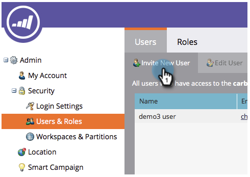

# Create an API Only User {#create-an-api-only-user}

Create an API Only User - Marketo Docs - Product Documentation

If you want to integrate with Marketo via the [REST API](http://developers.marketo.com/documentation/rest/), you'll need to create an API only user. Here's how.

>[!NOTE]
>
>**Prerequisites**
>
>* [Create an API Only User Role](create-an-api-only-user-role.md)
>

>[!NOTE]
>
>**Admin Permissions Required**

1. Under **Admin**, click **Users & Roles.** 

   

1. Click **Invite New User**.

   

1. Enter an Email, First Name, and Last Name for the API only user. Click **Next**.

   

   >[!TIP]
   >
   >Add an optional reason or an access expiration date. Access expiration dates are handy for short-term employees.

1. Select the **API Only** role and check the **API Only** checkbox. Click **Next**.

   

1. Click **Send**.

   

>[!NOTE]
>
>The pop-up says, "An invitation is not required for API only," but that doesn't mean you've done something wrong. It just means we'll create the role without an invite email having to be sent.

Alrighty then! Now let's go ahead and create the custom service. 

>[!NOTE]
>
>**Related Articles**
>
>* [Create a Custom Service for Use with ReST API](../../../../welcome-to-marketo-docs/product-docs/administration/additional-integrations/create-a-custom-service-for-use-with-rest-api.md)
>

