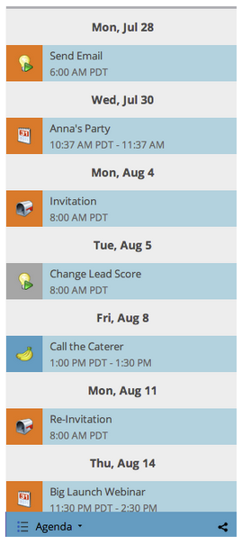

# Navigating the Marketing Calendar {#navigating-the-marketing-calendar}

Navigating the Marketing Calendar - Marketo Docs - Product Documentation

Navigating around the Marketing Calendar is easy as one, two, three!

>[!NOTE]
>
>**Prerequisites**
>
>Make sure you have a [Marketing Calendar license](issue-revoke-a-marketing-calendar-license.md) - otherwise the Marketing Calendar tile won't show up in My Marketo.

### What's in this article? {#what-s-in-this-article}

[Change Between Modes](#navigatingthemarketingcalendar-changebetweenmodes)  
[Use the Agenda View](#navigatingthemarketingcalendar-usetheagendaview)  
[Navigate Through Time](#navigatingthemarketingcalendar-navigatethroughtime)

1. Go to the **Marketing Calendar**.

   

1. This is a bird's-eye view of assets scheduled in your Marketo instance.

   

#### Change Between Modes {#navigatingthemarketingcalendar-changebetweenmodes}

1. Click the **3 weeks** or **Month** tabs to switch between modes.

   

#### Use the Agenda View {#navigatingthemarketingcalendar-usetheagendaview}

Agenda view displays all of your entries as a list.

1. Click the **Filter drop-down**.

   ` 

   `

1. Select the **Agenda** view.

   

   Awesome! This is a great view for seeing everything that's planned.

   

#### Navigate Through Time {#navigatingthemarketingcalendar-navigatethroughtime}

##### Without a DeLorean! Just click the navigation buttons.  {#navigatingthemarketingcalendar-withoutadelorean-justclickthenavigationbuttons}

` 

`

You can also use these keyboard shortcuts.

| Action | Keyboard Shortcut |
|---|---|
| Back in time |alt/opt + up |
| Forward in time |alt/opt + down |
| Go to "today" |alt/opt + t |

Awesome! These are the basics. You can also customize your view using filters.

>[!NOTE]
>
>**Related Articles**
>
>* [Filtering the Marketing Calendar](../../../../../welcome-to-marketo-docs/product-docs/core-marketo-concepts/marketing-calendar/working-with-the-calendar/filtering-the-marketing-calendar.md)
>

