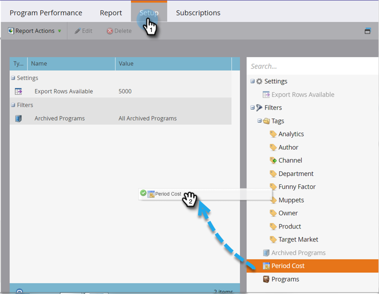

# Filter a Program Report by Period Cost {#filter-a-program-report-by-period-cost}

Filter a Program Report by Period Cost - Marketo Docs - Product Documentation

Focus your [program performance report](create-a-program-performance-report.md) on a specific period cost timeframe.

1. Go to **Marketing** **Activities** (or **Analytics**).

   

1. Select your program performance report.

   

1. Click the **Setup** tab and drag over **Period Cost**.

   

1. Enter the **From** and **To** dates for incurred costs and click **Apply**.

   

1. You're done! Click the **Report** tab to see just the programs that fall within the specified period cost timeframe.

   

   >[!NOTE]
   >
   >**Related Articles**
   >
   >    
   >    
   >    * [Filter a Program Report by Program](filter-a-program-report-by-program.md)
   >    
   >

   >[!NOTE]
   >
   >**Deep Dive**
   >
   >
   >Learn all about reports in [Basic Reporting](../../../../../welcome-to-marketo-docs/product-docs/reporting/basic-reporting.md).

