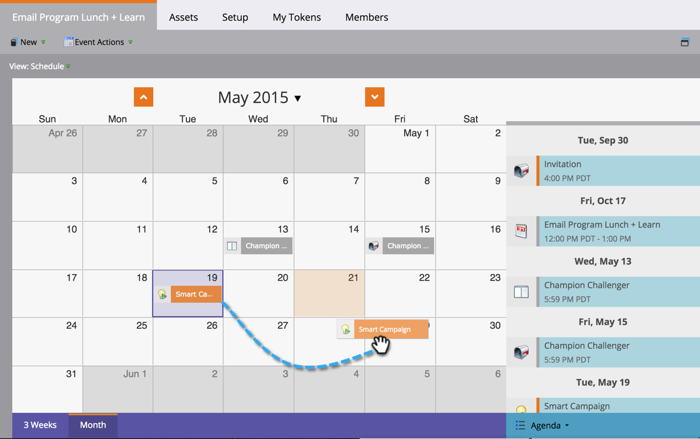

# Reschedule a Batch Smart Campaign in the Program Schedule View {#reschedule-a-batch-smart-campaign-in-the-program-schedule-view}

Reschedule a Batch Smart Campaign in the Program Schedule View - Marketo Docs - Product Documentation

Want to reschedule a batch smart campaign run? Drag and drop them into the future in the program schedule view.

1. Select the smart campaign you want to reschedule.

   

1. Drag and drop to the new date on which you want the campaign to run. 

1. Great! The smart campaign has been rescheduled. The time can also be changed from the **Date** drop-down in the entry details.

   

>[!NOTE]
>
>**Related Articles**
>
>[Rescheduling an Entire Program from the Schedule View](rescheduling-an-entire-program-from-the-schedule-view.md)

