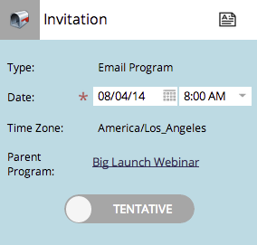
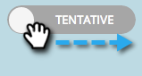

# Understanding Tentative/Confirmed Dates {#understanding-tentative-confirmed-dates}

Understanding Tentative/Confirmed Dates - Marketo Docs - Product Documentation

Smart campaigns and email programs have a powerful capability to be marked as **Tentative** or **Confirmed**. Here's how they work.

#### Tentative {#understandingtentative-confirmeddates-tentative}

Tentative dates convey intent. Think of this as *penciling *something in the calendar. Tentative entries will not run - they are placeholders only.

>[!NOTE]
>
>Only batch smart campaigns and email programs can be tentative.

## Confirming Entries {#understandingtentative-confirmeddates-confirmingentries}

This is just like approving an asset, so entries need to been fully set up before you can confirm them. Once all your ducks are in a row, you can confirm entries by sliding the tentative tab to the right.

  

>[!NOTE]
>
>Why the dog? He's a Golden Retriever. He's fetching your data.

#### Confirmed {#understandingtentative-confirmeddates-confirmed}

Confirmed entries will definitely run. They have rules, approved assets, and a confirmed date and time.

  

#### Finished  {#understandingtentative-confirmeddates-finished}

Finished entries have already run. They can only be in the past (obviously). Once an entry has run and is **Finished**, you cannot move it or make it tentative. (No changing reality and disrupting the time-stream continuum.)

These states are powerful tools. When you clone a program, all of the smart campaign and email program dates will be tentative. They can all be confirmed right from the schedule view. Cool, right?
