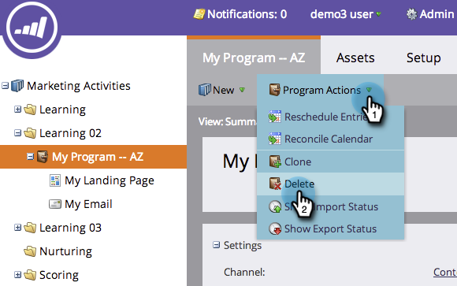

# Delete a Program {#delete-a-program}

Delete a Program - Marketo Docs - Product Documentation

You can archive a program, but sometimes you just want to get rid of it permanently. Here's how.

##### 1. Select the program you'd like to delete.  {#deleteaprogram-selecttheprogramyou'dliketodelete}

  

##### 2. Click Program Actions. Click Delete.  {#deleteaprogram-clickprogramactions-clickdelete}

  

##### 3. Select the Delete all option. Review the side effects of the program's deletion, then click Delete to confirm. {#deleteaprogram-selectthedeletealloption-reviewthesideeffectsoftheprogram'sdeletion-thenclickdeletetoconfirm}

>[!TIP]
>
>**Archiving Programs** keeps the program data but puts the program out of your way. Select that option then click **Next** to see more details about archiving.

Done. It's like the program never existed.

#### Why can't I delete my program? {#deleteaprogram-whycan'tideletemyprogram}

Programs can contain assets that are used elsewhere in the system - this will prevent you from deleting a program.

To fix the problem, you may need drill down and unapprove/delete. Follow these steps.

1. Click the link to go to the asset. 

   

1. Click **Used** **By** to see where the asset is in use. 

   

   Once you know where your asset is being used, go to it and unapprove/delete. Then try to delete your program again.

