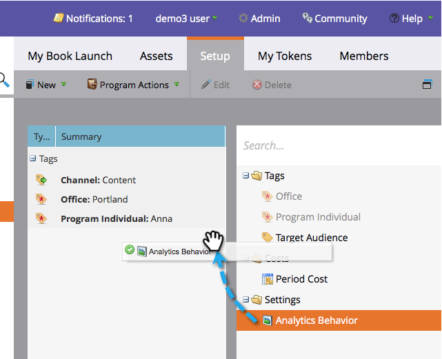

# Edit Analytics Behavior Settings {#edit-analytics-behavior-settings}

Edit Analytics Behavior Settings - Marketo Docs - Product Documentation

You can set the [analytics behavior at the admin level on channels](../../../../../welcome-to-marketo-docs/product-docs/reporting/revenue-cycle-analytics/program-analytics/make-a-program-without-a-period-cost-available-in-revenue-explorer-and-analyzers.md), but you can also edit it at the program level. Here's how.

##### 1. Go to Marketing Activities. {#editanalyticsbehaviorsettings-gotomarketingactivities}

##### 2. Find and select your program. {#editanalyticsbehaviorsettings-findandselectyourprogram}

##### 3. Under the Setup tab, drag Analytics Behavior into the canvas. {#editanalyticsbehaviorsettings-underthesetuptab-draganalyticsbehaviorintothecanvas}

  

##### 4. Select the Analytics Behavior you want. {#editanalyticsbehaviorsettings-selecttheanalyticsbehavioryouwant}

>[!NOTE]
>
>**Definition**
>
>* Inclusive - This option will ensure that the program is available for reporting in revenue explorer and analyzers regardless of whether or not you've included a period cost.
>* Operational - This option results in the program not showing up in either revenue explorer or analyzers.
>

>[!NOTE]
>
>The default behavior (if this setting is not applied) is the program would be included in Analytics ONLY if there is at least one period cost, even one with zero dollars assigned.

##### 5. Click Save. {#editanalyticsbehaviorsettings-clicksave}

Nicely done! Now you know how to override the analytics behavior at the program level.

>[!NOTE]
>
>**Reminder**
>
>The changes will take effect the next day and the program will either be made available or pulled out of revenue explorer and analyzers.

