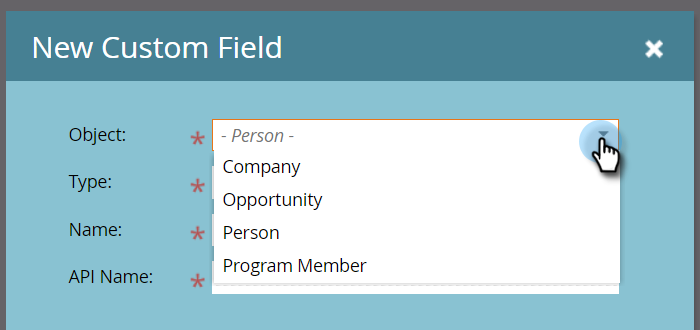

# Program Member Custom Fields {#program-member-custom-fields}

Program Member Custom Fields - Marketo Docs - Product Documentation

Program member custom fields allow you to collect program-specific data for each member. They can be used in: Marketo forms, Smart List filters and triggers, and Smart Campaign flow actions. The data is viewable in the program's Members tab.

### What's in this article? {#what-s-in-this-article}

[Create a Program Member Custom Field](#programmembercustomfields-createaprogrammembercustomfield)  
[Object Descriptions](#programmembercustomfields-objectdescriptions)  
[Triggers and Filters](#programmembercustomfields-triggersandfilters)  
[Things to Know](#programmembercustomfields-thingstoknow)

#### Create a Program Member Custom Field {#programmembercustomfields-createaprogrammembercustomfield}

1. In Marketo, click **Admin**.

   

1. Click **Field Management**.

   

1. Click **New Custom Field**.

   

1. Click the Object drop-down and select the desired object.

   

   >[!NOTE]
   >
   >Person and Program Member custom fields cannot share the same name.

1. Fill out the remaining fields and click **Create**.

   

   >[!NOTE]
   >
   >Types supported for Program Member custom fields are: boolean, date, datetime, float, integer, string, URL. [Learn more about field types](http://docs.marketo.com/x/Wwgt).

#### Object Descriptions {#programmembercustomfields-objectdescriptions}

| Object |Description |
|---|---|
| Company |The name of the company associated with the person. |
| Opportunity |An opportunity can be associated with a person or account as a potential future sale. They usually enter Marketo through a CRM, or via API. |
| Person |An individual in your Marketo database that you're engaging with through marketing campaigns. |
| Program Member |Person who is also a member of a program |

#### Triggers and Filters {#programmembercustomfields-triggersandfilters}

You can leverage this program-specific data in smart lists via [triggers](http://docs.marketo.com/x/PoAR)and/or [filters](http://docs.marketo.com/x/2YAI).

#### Things to Know {#programmembercustomfields-thingstoknow}

##### Program Member custom fields are available in local assets only. They are not supported in Design Studio because there's no way to tie it to a specific program. {#programmembercustomfields-programmembercustomfieldsareavailableinlocalassetsonly-theyarenotsupportedindesignstudiobecausethere'snowaytotieittoaspecificprogram}

##### You cannot clone/move a form (or a landing page with a form) that contains Program Member custom fields to the Design Studio. {#programmembercustomfields-youcannotclone-moveaform-oralandingpagewithaform-thatcontainsprogrammembercustomfieldstothedesignstudio}

##### Program Member custom fields cannot be used as tokens. {#programmembercustomfields-programmembercustomfieldscannotbeusedastokens}

##### The Program Member object can have up to 20 custom fields. Those fields are available to any program. {#programmembercustomfields-theprogrammemberobjectcanhaveupto20customfields-thosefieldsareavailabletoanyprogram}

##### When you remove a member of a program, if they have any data in their Program Member custom field, the data will be scrubbed from that field. {#programmembercustomfields-whenyouremoveamemberofaprogram-iftheyhaveanydataintheirprogrammembercustomfield-thedatawillbescrubbedfromthatfield}

##### To view the data, click the Members tab in the program and create a custom view that includes said field(s). {#programmembercustomfields-toviewthedata-clickthememberstabintheprogramandcreateacustomviewthatincludessaidfield-s}

##### Import and export via [list](http://docs.marketo.com/x/egAk)and [API](http://developers.marketo.com/)are supported. {#programmembercustomfields-importandexportvialistandapiaresupported}

##### When you merge two people, the winner’s Program Member custom field data will be used. But if the winner has none, the loser’s value will be used. {#programmembercustomfields-whenyoumergetwopeople-thewinner’sprogrammembercustomfielddatawillbeused-butifthewinnerhasnone-theloser’svaluewillbeused}

>[!NOTE]
>
>**Related Articles**
>
>[Create a Custom Field in Marketo](../../../../../welcome-to-marketo-docs/product-docs/administration/field-management/create-a-custom-field-in-marketo.md)

