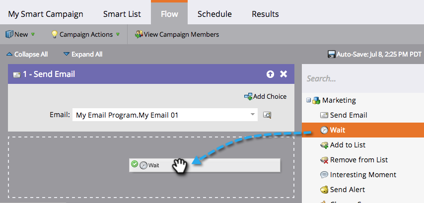
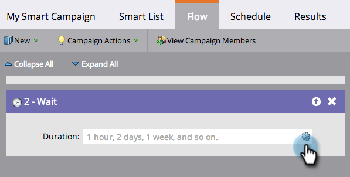

# Use a Specific Date in a Wait Flow Step {#use-a-specific-date-in-a-wait-flow-step}

Use a Specific Date in a Wait Flow Step - Marketo Docs - Product Documentation

You can use the **Wait** flow step to pause a person's journey through a smart campaign until a particular date.

1. In your smart campaign **Flow** tab, drag over the **Wait** flow step.

    

   ##### Click the gear icon to the right. {#useaspecificdateinawaitflowstep-clickthegearicontotheright}

    

   ##### From the Type drop-down, select Date.  {#useaspecificdateinawaitflowstep-fromthetypedrop-down-selectdate}

    

   ##### Select the specific date when you want to resume. {#useaspecificdateinawaitflowstep-selectthespecificdatewhenyouwanttoresume}

    

   ##### Specify the time (optional) and click Save. {#useaspecificdateinawaitflowstep-specifythetime-optional-andclicksave}

   

>[!NOTE]
>
>**Related Articles**
>
>* [Use a Duration in a Wait Flow Step](use-a-duration-in-a-wait-flow-step.md)
>* [Use a Date Token in a Wait Flow Step](use-a-date-token-in-a-wait-flow-step.md)
>

