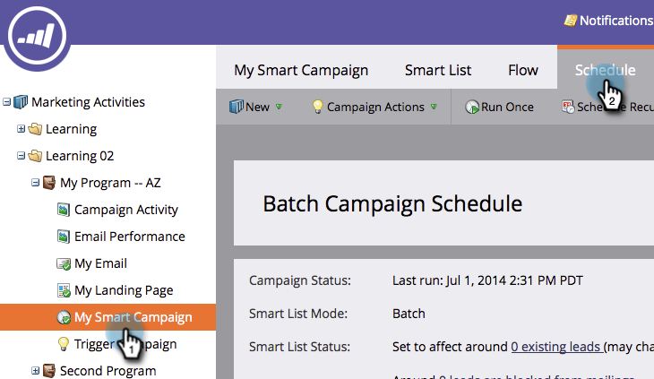
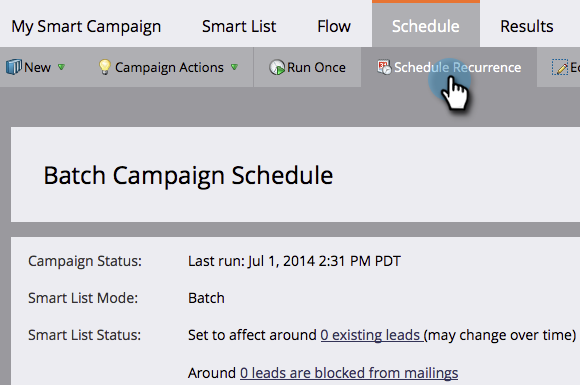
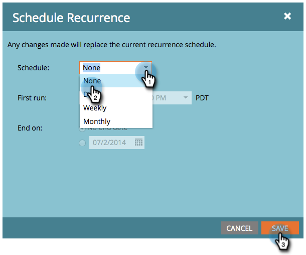

# Cancel a Scheduled Recurring Batch Campaign Run {#cancel-a-scheduled-recurring-batch-campaign-run}

Cancel a Scheduled Recurring Batch Campaign Run - Marketo Docs - Product Documentation

If you have a recurring batch campaign that you don't want any more, you can cancel the future runs. Here's how.

1. Click on the smart campaign, then the **Schedule** tab.

   

1. Click on **Schedule** **Recurrence**.

   

   >[!TIP]
   >
   >You can cancel a single run by clicking on  next to it. Learn how to [cancel a scheduled batch campaign run](cancel-a-scheduled-batch-campaign-run.md).

1. Set Schedule to **None** and then **Save**.

   

   Voila! Your smart campaign will not run anymore.

   >[!CAUTION]
   >
   >This cancels future runs, but if a smart campaign is in process of running, you cannot cancel it.

   >[!NOTE]
   >
   >**Related Articles**
   >
   >    
   >    
   >    * [Cancel a Scheduled Batch Campaign Run](cancel-a-scheduled-batch-campaign-run.md)
   >    
   >

