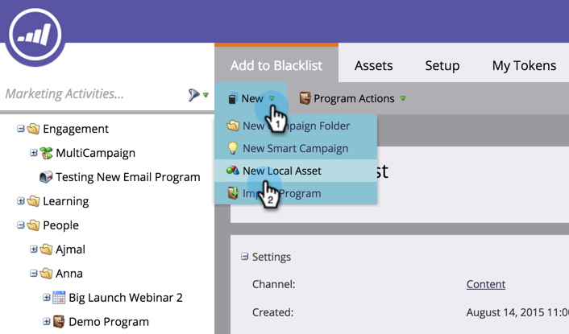
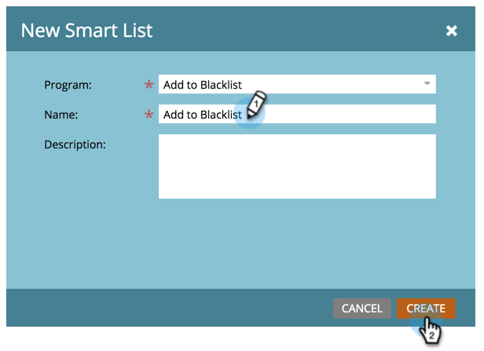
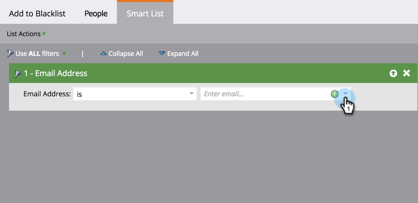
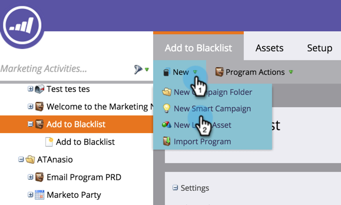
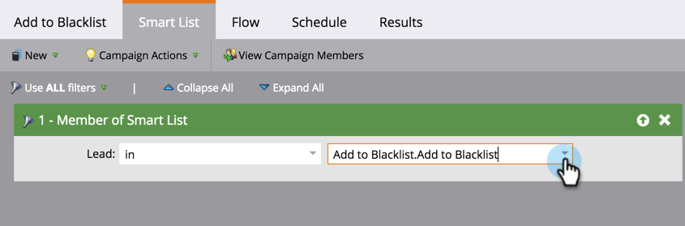
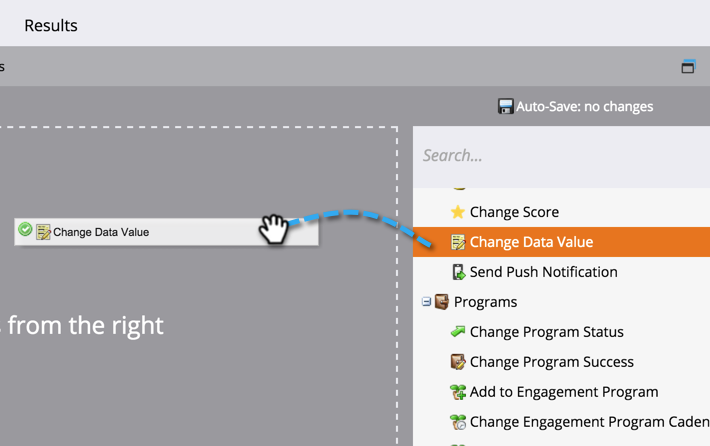
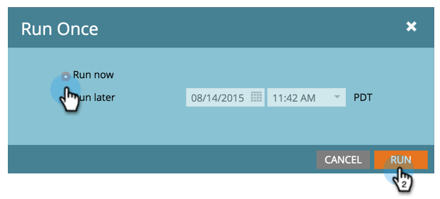

# Add Person to Blacklist {#add-person-to-blacklist}

Add Person to Blacklist - Marketo Docs - Product Documentation

Adding people to your Blacklist prevents them from receiving your correspondence.

>[!NOTE]
>
>**FYI**
>
>Marketo is now standardizing language across all subscriptions, so you may see lead/leads in your subscription and person/people in docs.marketo.com. These terms mean the same thing; it does not affect article instructions. There are some other changes, too. [Learn more](http://docs.marketo.com/display/DOCS/Updates+to+Marketo+Terminology).

1. [Create a new default program](../../../../../welcome-to-marketo-docs/product-docs/core-marketo-concepts/programs/creating-programs/create-a-program.md) and name it **Add to Blacklist**.
1. Click **New** and select **New Local Asset**.

   

1. Name your list and click **Create**.

   

1. Add all the people to your **Smart List** you want added to your Black List.

   >[!NOTE]
   >
   >People on your Black List will not receive operational emails.

   

1. Click **New** and select **New Smart Campaign**.

   

1. Name the **New Smart Campaign**. Click **Create**.

   

1. Drag and drop **Member of Smart List**.

   

1. Select the smart list you just created.

   

1. Drag and drop **Change Data Value**.

   

1. For the **Flow**, enter **Black Listed** for the **Attribute** and set **New Value** to **true**.

   

1. On the **Schedule** tab, select **Run Once**.

   

1. Select **Run now** and click **Run**.

   

   YAY! These people will no longer receive emails.

   >[!TIP]
   >
   >Create a [trigger smart campaign](../../../../../welcome-to-marketo-docs/product-docs/core-marketo-concepts/smart-campaigns/creating-a-smart-campaign/create-a-new-smart-campaign.md) using **Change Data Value** with **Black Listed is true** for all people in the future that have blacklistable attributes.

