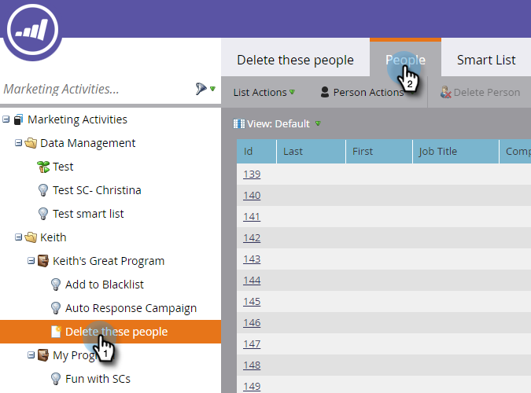

# Delete People in a Smart List or List {#delete-people-in-a-smart-list-or-list}

Delete People in a Smart List or List - Marketo Docs - Product Documentation

You can quickly and easily delete some/all people that are in a list or a smart list.

>[!NOTE]
>
>**FYI**
>
>Marketo is now standardizing language across all subscriptions, so you may see lead/leads in your subscription and person/people in docs.marketo.com. These terms mean the same thing; it does not affect article instructions. There are some other changes, too. [Learn more](http://docs.marketo.com/display/DOCS/Updates+to+Marketo+Terminology).

>[!NOTE]
>
>**Prerequisites**
>
>* [Create a Smart List](../../../../../welcome-to-marketo-docs/product-docs/core-marketo-concepts/smart-lists-and-static-lists/creating-a-smart-list/create-a-smart-list.md)
>

1. Go to **Marketing** **Activities**.

   

1. Select the list/smart list that contains all people you want to delete and go to the **People** tab.

   

   >[!CAUTION]
   >
   >When you delete a person, you are not just removing them from the list - they will be completely removed from the database.

1. Click **Select** **All**. You can also hand pick a few records by using Ctrl/Cmd and clicking.

   

   >[!NOTE]
   >
   >If the results span over multiple pages, clicking **Select** **All** will select all people across all pages.

1. To completely remove the people from Marketo, click **Delete** **Person**.

   

1. Set **Remove** **from** **CRM** to **true** if you want to delete the records from your CRM as well.

   

   >[!CAUTION]
   >
   >Deleting from Marketo and your CRM means you will never be able to recover in either system. The people and their histories will be gone forever. If you add them back later, they will be treated as brand new records.

   >[!NOTE]
   >
   >If your Marketo is not tied to your CRM the option is grayed out like in the screenshot.

1. Click **Run** **Now**.

   

1. If you are deleting more than 50 people you will see this. Type the number of people you're deleting, check the **Cannot Undo** box, then click **Delete**.

   

   >[!NOTE]
   >
   >To view the results of the mass deletion, click **View Results** in the Single Flow Action pop-up box in the upper-right corner of the screen. Deletion times can vary greatly, depending on multiple factors.

   This is a great feature, just be really careful when using it!

