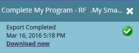

# Export People to Excel from a List or Smart List {#export-people-to-excel-from-a-list-or-smart-list}

Export People to Excel from a List or Smart List - Marketo Docs - Product Documentation

If you need list or smart list results outside of Marketo, you can easily export to Excel. Here's how.

>[!NOTE]
>
>**FYI**
>
>Marketo is now standardizing language across all subscriptions, so you may see lead/leads in your subscription and person/people in docs.marketo.com. These terms mean the same thing; it does not affect article instructions. There are some other changes, too. [Learn more](http://docs.marketo.com/display/DOCS/Updates+to+Marketo+Terminology).

1. Go to **Marketing Activities**.

   

1. Select the list or smart list you want to export and go to the **People** tab.

   

1. Towards the bottom of the page, click the Excel icon.

   

1. Select **Visible Columns** and click **Export**.

   

   >[!NOTE]
   >
   >If you choose **All Columns**, the export will be larger in size and take longer to generate/download.

   >[!TIP]
   >
   >If your person records contain foreign characters that aren't rendering properly upon export, try changing the file type in the **Format** drop-down.

1. The export will run. Once finished you can click **Download now** to grab the file.

   

   >[!TIP]
   >
   >If the export is taking a while, you can always log out and come back to it later. The **Download now** link can be accessed by selecting **Show Export Status** in the **List Actions** menu, and is valid for one week.

   After you export a smart list to Excel, Marketo will automatically cache the list. You'll notice a little paper clip and sticky note on the smart list icon the next time you log-in or refresh your browser.

   

   >[!TIP]
   >
   >You can undo the caching of the list simply by pressing the list's refresh button.

