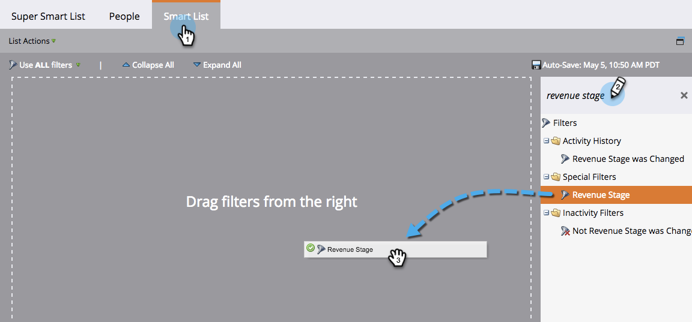
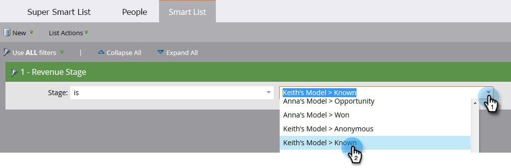
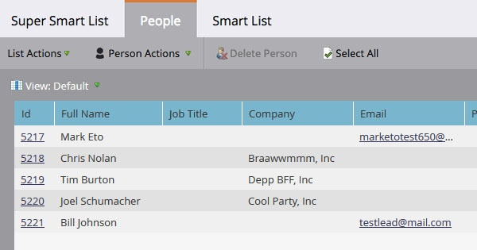

# Find All People in a Revenue Stage {#find-all-people-in-a-revenue-stage}

Find All People in a Revenue Stage - Marketo Docs - Product Documentation

>[!NOTE]
>
>**Prerequisites**
>
>* [Create a Smart List](../../../../../welcome-to-marketo-docs/product-docs/core-marketo-concepts/smart-lists-and-static-lists/creating-a-smart-list/create-a-smart-list.md)
>

### What's in this article? {#what-s-in-this-article}

[Find All Members of a Specific Revenue Stage](#findallpeopleinarevenuestage-findallmembersofaspecificrevenuestage)  
[Run a Flow Step on the Members of a Revenue Stage](#findallpeopleinarevenuestage-runaflowsteponthemembersofarevenuestage)

#### Find All Members of a Specific Revenue Stage {#findallpeopleinarevenuestage-findallmembersofaspecificrevenuestage}

1. In a smart list, click the **Smart List **tab, find the **Revenue Stage** filter, and drag it into the canvas.

   

1. Select a **Revenue Stage**.

   

1. Go to the **People** tab to view the results.

   

#### Run a Flow Step on the Members of a Revenue Stage {#findallpeopleinarevenuestage-runaflowsteponthemembersofarevenuestage}

Now that you know which people are in which revenue stages, you can market directly to them. Besides choosing **Revenue Stage** as a smart list filter, you can also choose it as an "if" filter in the flow.

1. In the desired flow step, click **Add Choice** and select **Revenue Stage** from the drop-down.

   

   From there you can choose which members are affected by which aspect of the flow step. Fun!

