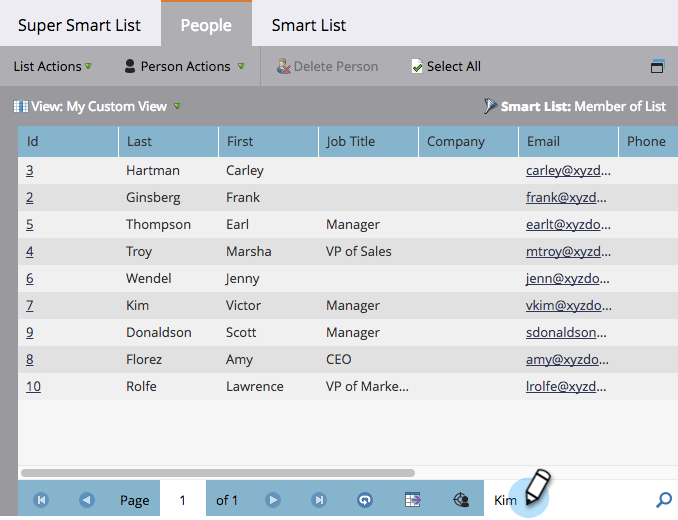
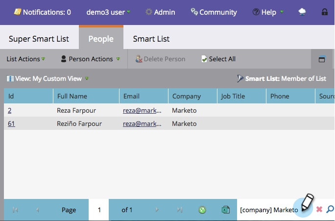

# Use Quick Find in a List or Smart List {#use-quick-find-in-a-list-or-smart-list}

Use Quick Find in a List or Smart List - Marketo Docs - Product Documentation

Find a person from the results of a list or smart list using the quick find.

### What's in this article? {#what-s-in-this-article}

[Find People Using Personal Info](#usequickfindinalistorsmartlist-findpeopleusingpersonalinfo)  
[Find People Using a Company Name](#usequickfindinalistorsmartlist-findpeopleusingacompanyname)

1. Go to **Marketing Activities**.

   

1. Select the smart list you want to search and then click the **People** tab.

   

#### Find People Using Personal Info {#usequickfindinalistorsmartlist-findpeopleusingpersonalinfo}

1. In the **Quick Find** box at the bottom of the screen, type a key word (**personal name**, **email address**, or **job title**).

   

1. Press Enter or click the search icon and you're done!

#### Find People Using a Company Name {#usequickfindinalistorsmartlist-findpeopleusingacompanyname}

1. To find a company, type [**company**] in the **Quick Find** box, followed by any part of the company name you're looking for.

   

1. Press Enter or click the search icon and you're done!

Congratulations — fast work!
