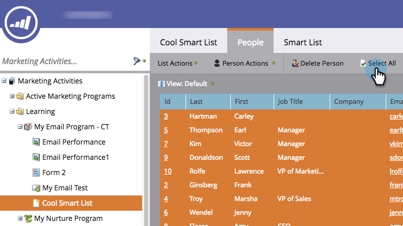
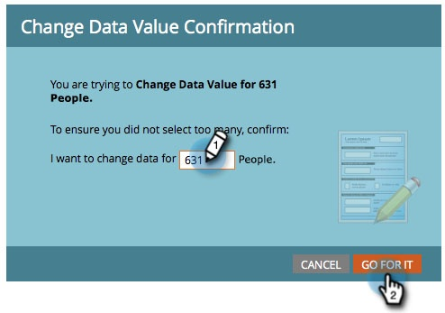
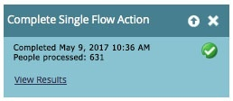

# Run a Single Flow Step from a Smart List {#run-a-single-flow-step-from-a-smart-list}

Run a Single Flow Step from a Smart List - Marketo Docs - Product Documentation

If you want to run a one-time only flow step, you can use a single flow step within a smart list instead of creating an entire smart campaign.

>[!NOTE]
>
>**Prerequisites**
>
>* [Create a Smart List](../../../../../welcome-to-marketo-docs/product-docs/core-marketo-concepts/smart-lists-and-static-lists/creating-a-smart-list/create-a-smart-list.md)
>

1. Go to **Marketing Activities**. 

   

1. Select a list or smart list with people in it, then go to the **People** tab. 

   

   >[!TIP]
   >
   >Both static lists as well as smart lists have this functionality.

1. Click **Select All**. You can also use** Ctrl/Cmd** and click to select a few records manually.

   

   >[!NOTE]
   >
   >If the results span over multiple pages, clicking **Select All** will select all people across all pages.

1. Under **Person** **Actions**, select the flow step of your choice. In this example we will use [Change Data Value](../../../../../welcome-to-marketo-docs/product-docs/core-marketo-concepts/smart-campaigns/flow-actions/change-data-value.md).

   

1. Find and select an **Attribute**. In this example we will take all people who have state "California" and change it to "CA."

   

1. Enter a new value. Click **Run Now**.

   

1. If you're changing data values for a large number of people, you may need to confirm the change by typing in the number. Click **Go For It**. 

   

Awesome work! You will see the status of the single flow step in the top right hand corner.

When it's finished, refresh the list and you will see the updated info.
