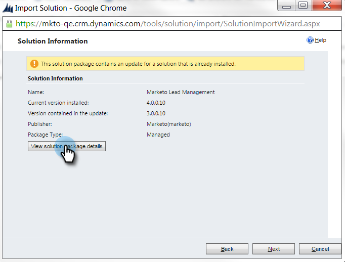

# Step 1 of 3: Install the Marketo Solution (Online) {#step-of-install-the-marketo-solution-online}

Step 1 of 3: Install the Marketo Solution (Online) - Marketo Docs - Product Documentation

Before you can sync Microsoft Dynamics 365 and Marketo, you need to first install the Marketo solution in Dynamics. **Dynamics Admin Permissions are required.**

>[!CAUTION]
>
>If you have Multi-Factor Authentication (MFA) enabled for your Dynamics Sync, you must disable it in order for Dynamics to properly sync with Marketo. For additional information, please contact [Marketo Support](http://nation.marketo.com/community/support_solutions).

>[!NOTE]
>
>After you sync Marketo to a CRM, you cannot perform a new sync without replacing the instance.

>[!NOTE]
>
>**Prerequisites**
>
>[Download the Marketo Lead Management Solution](../../../../../../welcome-to-marketo-docs/product-docs/crm-sync/microsoft-dynamics-sync/sync-setup/download-the-marketo-lead-management-solution.md)

1. Log into ** [Microsoft Office 365](https://login.microsoftonline.com/) **.

   

1. Click menu and select **CRM**.

   

1. Click  menu. In the dropdown menu select **Settings **then select **Solutions**.

   

1. Click **Import.**

   ** 

   **

1. Click **Choose File.** Select the Marketo Lead Management solution you [downloaded](../../../../../../welcome-to-marketo-docs/product-docs/crm-sync/microsoft-dynamics-sync/sync-setup/download-the-marketo-lead-management-solution.md). Click **Next**.

   

1. View the Solution Information and click **View solution package details**.

   

1. When you're done checking all the details, click **Close**.

   

1. Now, back on the Solution Information page, click **Next**.

   

1. Make sure the SDK option checkbox is selected. Click **Import**.

   

   >[!TIP]
   >
   >You will need to enable pop-ups on your browser to complete the installation process.

1. Now wait for the import to finish. Get up and do some stretches.

   

1. Click **Close.**

   >[!NOTE]
   >
   >You may see a message saying "Marketo Lead Management completed with warning". This is fully expected.

   

1. Marketo Lead Management will now show up in the list of solutions.

   

1. Select **Marketo Lead Management** and click **Publish All Customizations.**

   

   High five! The installation is finished.

   >[!NOTE]
   >
   >**Related Articles**
   >
   >
   >[Step 2 of 3: Set up Marketo Sync User in Dynamics](step-2-of-3-set-up-marketo-sync-user-in-dynamics.md)

