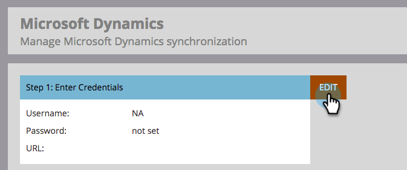

# Step 3 of 3: Connect Microsoft Dynamics with Marketo (Online) {#step-of-connect-microsoft-dynamics-with-marketo-online}

Step 3 of 3: Connect Microsoft Dynamics with Marketo (Online) - Marketo Docs - Product Documentation

>[!NOTE]
>
>**FYI**
>
>Marketo is now standardizing language across all subscriptions, so you may see lead/leads in your subscription and person/people in docs.marketo.com. These terms mean the same thing; it does not affect article instructions. There are some other changes, too. [Learn more](http://docs.marketo.com/display/DOCS/Updates+to+Marketo+Terminology).

This is the last step of the sync. We're almost there!

>[!NOTE]
>
>**Prerequisites**
>
>* [Step 1 of 3: Install the Marketo Solution (Online)](step-1-of-3-install-the-marketo-solution-online-.md)
>
>* [Step 2 of 3: Set up Marketo Sync User in Dynamics](step-2-of-3-set-up-marketo-sync-user-in-dynamics.md)
>

>[!NOTE]
>
>**Admin Permissions Required**

### What's in this article? {#what-s-in-this-article}

[Enter Dynamics Sync User information](#step3of3-connectmicrosoftdynamicswithmarketo-online--enterdynamicssyncuserinformation)  
[Select Fields to Sync](#step3of3-connectmicrosoftdynamicswithmarketo-online--selectfieldstosync)  
[Sync Fields for a Custom Filter](#step3of3-connectmicrosoftdynamicswithmarketo-online--syncfieldsforacustomfilter)  
[Enable Sync](#step3of3-connectmicrosoftdynamicswithmarketo-online--enablesync)

#### Enter Dynamics Sync User information {#step3of3-connectmicrosoftdynamicswithmarketo-online--enterdynamicssyncuserinformation}

1. Log into Marketo and click **Admin**.

   

1. Click on **CRM**.

   

1. Select **Microsoft**.

   

1. Click **Edit** in **Step 1: Enter Credentials**.

   

   >[!CAUTION]
   >
   >Please make sure your credentials are correct as we are unable to revert the subsequent schema changes after submission. If incorrect credentials are saved, you’ll have to obtain a new Marketo subscription.

1. Enter the **Username**, **Password**, and Microsoft Dynamics **URL** (Client ID and Client Secret are optional). Click **Save** when done.

   

   >[!NOTE]
   >
   >The Username in Marketo must match the User Name for the sync user in CRM. The format can be [`[email protected]`](http://docs.marketo.com/cdn-cgi/l/email-protection#8bfef8eef9cbefe4e6eae2e5a5e8e4e6) or DOMAIN\user.

#### Select Fields to Sync {#step3of3-connectmicrosoftdynamicswithmarketo-online--selectfieldstosync}

1. Click **Edit **in **Step 2: Select Fields to Sync**.

   

1. Select the fields that you want to sync to Marketo, so they will be pre-selected. Click **Save**.

   

#### Sync Fields for a Custom Filter {#step3of3-connectmicrosoftdynamicswithmarketo-online--syncfieldsforacustomfilter}

If you've created a custom filter, be sure to go in and select the new fields to be synced with Marketo.

1. Go to Admin and select **Microsoft Dynamics**.

   

1. Click **Edit **on Field Sync Details.

   

1. Scroll down to the field and check it. The actual name must be new_synctomkto but the Display Name can be anything. Click **Save**.

   

#### Enable Sync {#step3of3-connectmicrosoftdynamicswithmarketo-online--enablesync}

1. Click **Edit** in **Step 3: Enable Sync**.

   

   >[!CAUTION]
   >
   >Marketo will not automatically de-dupe against a Microsoft Dynamics sync, or when you manually enter people or leads.

1. Read everything in the pop-up, enter your email address, and click **Start Sync**.

   

1. The first sync may take a few hours. Once it's done, you'll receive an email notification.

   

Excellent work!
