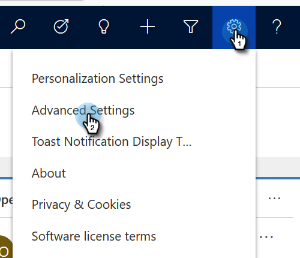
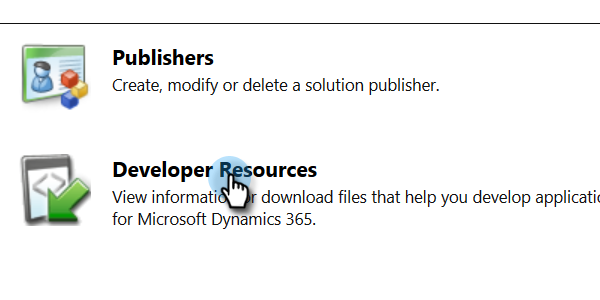
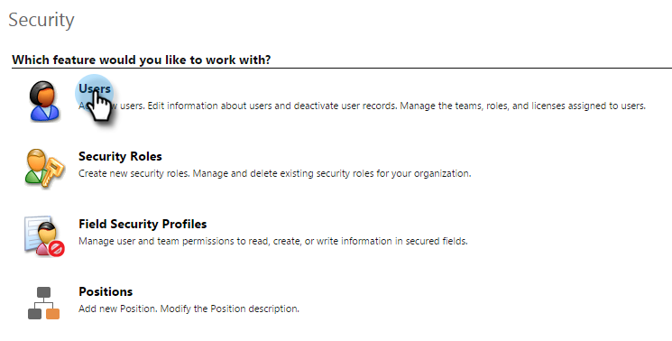
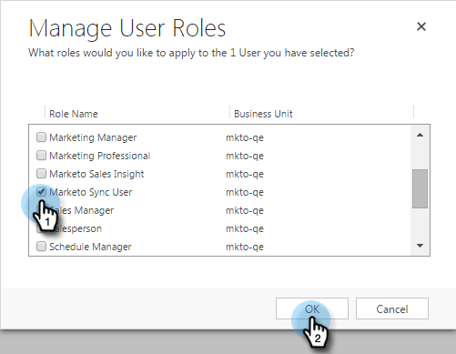

# Fix Dynamics Validation Sync Issues {#fix-dynamics-validation-sync-issues}

Fix Dynamics Validation Sync Issues - Marketo Docs - Product Documentation

### What's in this article? {#what-s-in-this-article}

[Validate Sync Tool Results](#fixdynamicsvalidationsyncissues-validatesynctoolresults)  
[URL is valid](#fixdynamicsvalidationsyncissues-urlisvalid)  
[Username and password are valid](#fixdynamicsvalidationsyncissues-usernameandpasswordarevalid)  
[Sync user is assigned to the Marketo Sync User role](#fixdynamicsvalidationsyncissues-syncuserisassignedtothemarketosyncuserrole)  
[Marketo solution is properly installed](#fixdynamicsvalidationsyncissues-marketosolutionisproperlyinstalled)  
[All steps in the solution are enabled](#fixdynamicsvalidationsyncissues-allstepsinthesolutionareenabled)  
[Sync user is assigned to the Marketo solution](#fixdynamicsvalidationsyncissues-syncuserisassignedtothemarketosolution)  
[Sync user matches username and password](#fixdynamicsvalidationsyncissues-syncusermatchesusernameandpassword)

#### Validate Sync Tool Results {#fixdynamicsvalidationsyncissues-validatesynctoolresults}

##### When you run the Dynamics Validate Sync, it generates this report. If there's an  next to a step, see below to identify and fix the problem. Then rerun the sync validation steps until the result shows nothing but checkmarks. {#fixdynamicsvalidationsyncissues-whenyourunthedynamicsvalidatesync-itgeneratesthisreport-ifthere'sannexttoastep-seebelowtoidentifyandfixtheproblem-thenrerunthesyncvalidationstepsuntiltheresultshowsnothingbutcheckmarks}

#### URL is valid {#fixdynamicsvalidationsyncissues-urlisvalid}

If you have an  here, verify that the URL is valid. Find it here in Developer Resources and look at Organization Service. The URL could be invalid for a number of reasons.

1. Log-in to Dynamics. Click the Settings icon and select **Advanced Settings**.

   

1. Click Settings and select **Customizations**.

   

1. Click **Developer Resources**.

   

1. The Organization Service URL can be found under Service Endpoints.

   

#### Username and password are valid {#fixdynamicsvalidationsyncissues-usernameandpasswordarevalid}

If you have an  here, verify that your Microsoft Dynamics username and password are valid.

#### Sync user is assigned to the Marketo Sync User role {#fixdynamicsvalidationsyncissues-syncuserisassignedtothemarketosyncuserrole}

If you have an  here, you need to verify that the Marketo Sync User role is checked in Microsoft Dynamics. See Step 2 of the MIcrosoft Dynamics installation documentation.

1. In Dynamics, click the Settings icon and select **Advanced Settings**.

   

1. Click **Settings** and select **Security**.

   

1. Click **Users.**

   

1. Click the link for the sync user.

   

1. Click **Manage Roles**.

   

1. Verify that the Marketo Sync User role is checked. If not, check it and click **OK.**

   

#### Marketo solution is properly installed {#fixdynamicsvalidationsyncissues-marketosolutionisproperlyinstalled}

If you have an  here, Go to Microsoft Dynamics to verify the Marketo installation is there. See Step 1 of the MIcrosoft Dynamics setup documentation.

1. In Dynamics, click the Settings icon and select **Advanced Settings**.

   

1. Click **Settings **and select **Solutions.**

   

1. Verify the solution is listed.

   

#### All steps in the solution are enabled {#fixdynamicsvalidationsyncissues-allstepsinthesolutionareenabled}

If you have an  here, verify that none of the default steps have been deactivated. All steps are automatically enabled at installation, but they could be deactivated during a customization.

#### Sync user is assigned to the Marketo solution {#fixdynamicsvalidationsyncissues-syncuserisassignedtothemarketosolution}

If you have an  here, make sure the Sync user is assigned on the Marketo Default page in Microsoft Dynamics.

1. In Dynamics, click the Settings icon and select **Advanced Settings**.

   

1. Click **Settings **and select **Marketo Config**.

   

1. Verify that the sync user is assigned as the default.

   

#### Sync user matches username and password {#fixdynamicsvalidationsyncissues-syncusermatchesusernameandpassword}

If you have an  here, be sure to assign the proper sync user in the Marketo User field in the Marketo Config Default setup step in Microsoft Dynamics.

>[!NOTE]
>
>**Related Articles**
>
>[Validate Microsoft Dynamics Sync](../../../../../../welcome-to-marketo-docs/product-docs/crm-sync/microsoft-dynamics-sync/sync-setup/validate-microsoft-dynamics-sync.md)

