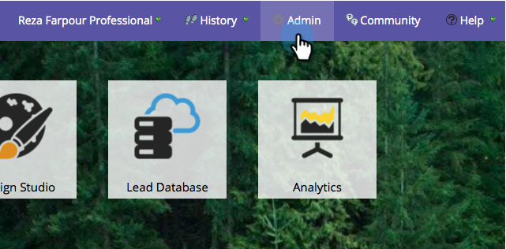

# Enable/Disable the Salesforce Sync {#enable-disable-the-salesforce-sync}

Enable/Disable the Salesforce Sync - Marketo Docs - Product Documentation

When making major changes to your sync or field settings, you should disable the sync while you configure. Here is how:

1. Go to the **Admin** section.

   ** 

   **

1. Under **Salesforce**, click **Disable Sync**.

   

1. The two way sync is now turned off and inactive until you re-enable it. Salesforce flow actions will continue to work.

   

1. Make your changes and re-enable the sync. It's the same button.

