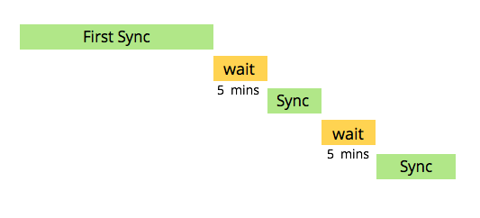

# Understanding the Salesforce Sync {#understanding-the-salesforce-sync}

Understanding the Salesforce Sync - Marketo Docs - Product Documentation

Marketo and Salesforce go together like peas and carrots. We keep your sales and marketing data in sync.

### What's in this article? {#what-s-in-this-article}

[How Sync Works](#understandingthesalesforcesync-howsyncworks)  
[What is Synced between Marketo and Salesforce?](#understandingthesalesforcesync-whatissyncedbetweenmarketoandsalesforce)

#### How Sync Works {#understandingthesalesforcesync-howsyncworks}

Marketo syncs with Salesforce all day, every day. Each sync takes some time and then pauses for 5 minutes, then starts again.

>[!NOTE]
>
>The very first sync in your subscription may take hours or even days because Marketo is copying the entire database from Salesforce. After that, each sync typically takes seconds or minutes and only syncs data that has changed.

The sync between Salesforce and Marketo is bidirectional only for leads, contacts, and Salesforce campaigns. In these cases, whenever you make changes in either Salesforce or Marketo, your updates will be reflected in both systems. All other syncs are from Salesforce to Marketo only. Click the links below for details on each one.

#### What is Synced between Marketo and Salesforce? {#understandingthesalesforcesync-whatissyncedbetweenmarketoandsalesforce}

* [Leads](sfdc-sync-details/sfdc-sync-lead-sync.md)
* [Contacts](sfdc-sync-details/sfdc-sync-contact-sync.md)
* [Accounts](sfdc-sync-details/sfdc-sync-account-sync.md)
* [Users](sfdc-sync-details/sfdc-sync-lead-account-owner-sync.md)
* [Opportunities](sfdc-sync-details/sfdc-sync-opportunity-sync.md)
* [Salesforce campaigns](sfdc-sync-details/sfdc-sync-campaign-sync.md)
* [Custom objects](sfdc-sync-details/sfdc-sync-custom-object-sync.md)
* [Activity](sfdc-sync-details/sfdc-sync-activity-sync.md)

>[!NOTE]
>
>The [credentials you enter in Marketo for Salesforce](setup/enterprise/unlimited-edition/step-2-of-3-create-a-salesforce-user-for-marketo-enterprise-unlimited-.md) are used to sync data over. Only data those credentials have access to will be included.

There are many nuances and features about Salesforce sync. Check out the details in the [SFDC sync details section](sfdc-sync-details.md).

>[!NOTE]
>
>**Related Articles**
>
>* [Salesforce Sync Setup](setup.md)
>* [SFDC Sync Details](sfdc-sync-details.md)
>

Marketo's sync with Salesforce is the most powerful of its kind in the world. It feels like magic – a change is made and the other system is soon up-to-date. 