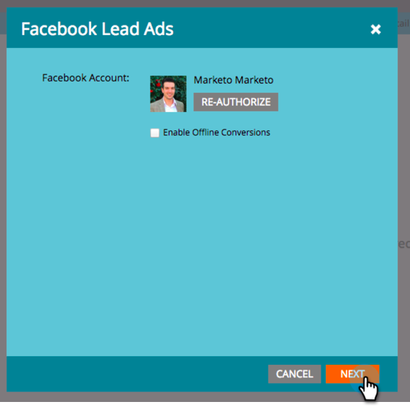
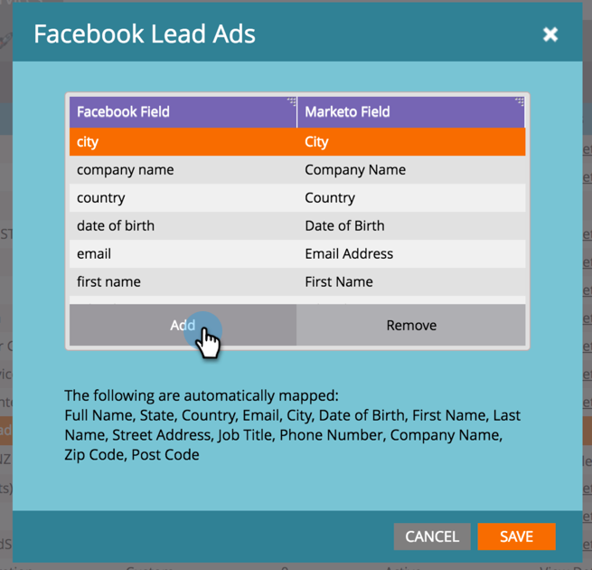

# Map Custom Fields to Marketo {#map-custom-fields-to-marketo}

Map Custom Fields to Marketo - Marketo Docs - Product Documentation

You may want to collect more than the standard information Facebook stores by default, such as how often someone uses your online delivery service. You can accomplish this by [creating custom questions](https://www.facebook.com/business/help/774623835981457?helpref=uf_permalink) in your Facebook lead ads.

However, **Marketo will not automatically start gathering this data**.** **In order for Marketo to start capturing custom field values, you **must** map those custom fields to a field in Marketo.

Here's how to set this up in the LaunchPoint area of Admin.

>[!NOTE]
>
>**Admin Permissions Required**

1. Go to the Admin area and click **LaunchPoint**. Under Installed Services, find and edit **Facebook Lead Ads**.

   

1. Click **Next**.

   

1. Leave the authorized account as is—do **not** make any changes. Click **Next**.

   

1. As before, leave the selected pages as is—do **not** make any changes. Click **Next**.

   

1. Here's where you map the custom Facebook field to your Marketo field. Click **Add.**

   ** 

   **

1. In the new row, enter the name of your Facebook custom field.

   

   >[!NOTE]
   >
   >Only fields that have been saved to Facebook form templates will appear as options here.

1. Click in the **Marketo Field** column. Type to search for the field you want to map to. Once you've selected a field, click **Save**.

   

   >[!NOTE]
   >
   >If you don't already have a field in Marketo to map the Facebook field to, learn how to [create custom fields](../../../../../welcome-to-marketo-docs/product-docs/administration/field-management/create-a-custom-field-in-marketo.md).

>[!CAUTION]
>
>You **must** go through this process for any new Facebook field in order for Marketo to gather the data.

