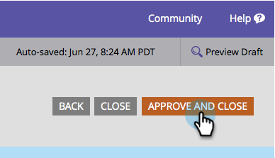

# Add a Field to a Form {#add-a-field-to-a-form}

Add a Field to a Form - Marketo Docs - Product Documentation

Once you've [created your form](create-a-form.md) and [selected a theme](select-a-form-theme.md), you may want to add additional fields for people to fill out. Here's how.

1. Go to **Marketing** **Activities**.

   

1. Select your form and click **Edit** **Form**. 

   

1. Click the **+** sign. 

   

   >[!NOTE]
   >
   >When you create a new form, First Name, Last Name, and Email Address are automatically added.

1. Find and select the field you want to add to your form.

   

1. Add as many fields as you need and click **Finish**.

   

1. Now click** Approve and Close**.

   

>[!NOTE]
>
>**Reminder**
>
>Be sure to approve any landing page drafts created due to the form changes.

Not bad at all. Keep up the good work! How about we learn how to [make a form field required](make-a-form-field-required.md) next? 