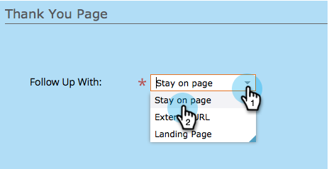
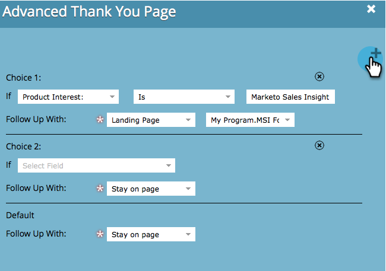
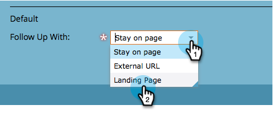
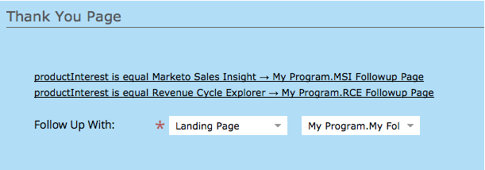
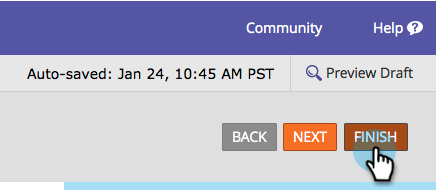

# Set a Form Thank You Page {#set-a-form-thank-you-page}

Set a Form Thank You Page - Marketo Docs - Product Documentation

### What's in this article? {#what-s-in-this-article}

[Edit Form](#setaformthankyoupage-editform)  
[Stay On Page](#setaformthankyoupage-stayonpage)  
[External URL](#setaformthankyoupage-externalurl)  
[Landing Page](#setaformthankyoupage-landingpage)  
[Dynamic Thank You Pages](#setaformthankyoupage-dynamicthankyoupages)  
What happens when someone fills out a form? Where are they forwarded to? Here's how to configure it.

#### Edit Form {#setaformthankyoupage-editform}

1. Go to **Marketing** **Activities**.

   

1. Select your form and click **Edit Form**.

   

1. Under **Form** **Settings** click **Settings**.

   

1. Scroll down to the **Thank** **You** **Page** section.

#### Stay On Page {#setaformthankyoupage-stayonpage}

The Stay On Page option will keep the visitor on the same page when the form has been submitted.

1. Select **Stay** **On** **Page** for **Follow** **Up** **With**.

   

#### External URL {#setaformthankyoupage-externalurl}

The External URL setting allows you to define any URL as the follow-up page. Once the user has submitted the form they will be directed to the URL specified.

1. Select **External** **URL** for **Follow** **Up** **With**.

   

1. Enter the full URL.

   

>[!TIP]
>
>The URL can be that of a file hosted somewhere - if you do this, the "Submit" button will behave like a "Download" button.

#### Landing Page {#setaformthankyoupage-landingpage}

You can select any approved Marketo landing page as the follow-up.

1. Set **Follow Up With** to **Landing Page**.

   

1. Find and select the landing page you want.

   

#### Dynamic Thank You Pages {#setaformthankyoupage-dynamicthankyoupages}

You can add multiple options and build in choices to show people different follow-ups depending on their responses.

1. Click **Add** **Choice**.

   

1. Select the field you want to monitor the response of. 

   

   >[!TIP]
   >
   >Only fields added to the form are available for this.

1. Select the logical operator you want.

   

1. Enter one of the values the user will respond with.

   

1. Choose the appropriate page for **Follow** **Up** **With** type.

   

1. Select the appropriate landing page.

   

   >[!NOTE]
   >
   >**Reminder**
   >
   >
   >You must have created/approved these landing pages ahead of time.

1. Click the **+** sign to add another choice.

   

   >[!NOTE]
   >
   >You can add several choices. If you add too many, however, it can affect the form's loading speed, so only add what you need.

1. Go through and set up **Choice** **2**.

   

   >[!TIP]
   >
   >Feel free to mix and match follow-up types. You can use a landing page for one choice and a URL for another.

1. Set a Default page for all other responses.

   

1. Select the page itself and click **Save**.

   

   OK, looks good!

   

1. Click **Finish**.

   

1. Click **Approve and Close**.

   

Great job! 
