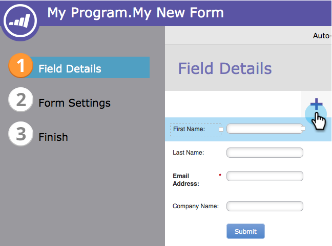
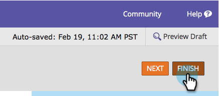

# Add a Country Picklist to your Form {#add-a-country-picklist-to-your-form}

Add a Country Picklist to your Form - Marketo Docs - Product Documentation

Follow these instructions to convert the country field to a drop-down with a list of all the countries.

1. Go to **Marketing** **Activities**.

   

1. Select your form and click **Edit** **Form**.

   

1. Click the** +** sign.

   

1. Find and select **Country**.

   

1. With the **Country** field selected change the **Field** **Type** to **Select**.

   

1. **Edit** the **Values** to add the list of countries users can choose from.

   

1. Click **Advanced** **Editor**.

   

1. Select and copy this list of countries:

   `<pre data-theme="Confluence">AfghanistanAlbaniaAlgeriaAndorraAngolaAntigua & DepsArgentinaArmeniaAustraliaAustriaAzerbaijanBahamasBahrainBangladeshBarbadosBelarusBelgiumBelizeBeninBhutanBoliviaBosnia HerzegovinaBotswanaBrazilBruneiBulgariaBurkinaBurundiCambodiaCameroonCanadaCape VerdeCentral African RepChadChileChinaColombiaComorosCongoCongo (Democratic Rep)Costa RicaCroatiaCubaCyprusCzech RepublicDenmarkDjiboutiDominicaDominican RepublicEast TimorEcuadorEgyptEl SalvadorEquatorial GuineaEritreaEstoniaEthiopiaFijiFinlandFranceGabonGambiaGeorgiaGermanyGhanaGreeceGrenadaGuatemalaGuineaGuinea-BissauGuyanaHaitiHondurasHungaryIcelandIndiaIndonesiaIranIraqIreland (Republic)IsraelItalyIvory CoastJamaicaJapanJordanKazakhstanKenyaKiribatiKorea NorthKorea SouthKosovoKuwaitKyrgyzstanLaosLatviaLebanonLesothoLiberiaLibyaLiechtensteinLithuaniaLuxembourgMacedoniaMadagascarMalawiMalaysiaMaldivesMaliMaltaMarshall IslandsMauritaniaMauritiusMexicoMicronesiaMoldovaMonacoMongoliaMontenegroMoroccoMozambiqueMyanmar (Burma)NamibiaNauruNepalNetherlandsNew ZealandNicaraguaNigerNigeriaNorwayOmanPakistanPalauPanamaPapua New GuineaParaguayPeruPhilippinesPolandPortugalQatarRomaniaRussian FederationRwandaSt Kitts & NevisSt LuciaSaint Vincent & the GrenadinesSamoaSan MarinoSao Tome & PrincipeSaudi ArabiaSenegalSerbiaSeychellesSierra LeoneSingaporeSlovakiaSloveniaSolomon IslandsSomaliaSouth AfricaSouth SudanSpainSri LankaSudanSurinameSwazilandSwedenSwitzerlandSyriaTaiwanTajikistanTanzaniaThailandTogoTongaTrinidad & TobagoTunisiaTurkeyTurkmenistanTuvaluUgandaUkraineUnited Arab EmiratesUnited KingdomUnited StatesUruguayUzbekistanVanuatuVatican CityVenezuelaVietnamYemenZambiaZimbabwe</pre>` 

1. Paste the list into the editor.

   

   >[!TIP]
   >
   >Feel free to edit the list or to use any other list.

1. Click **Save**.

   

1. Click **Finish**.

   

1. Click **Approve and Close**.

   

   Nicely done! Now when a person fills out your form they can pick from the list of countries you provided.

   

Since that was so easy, why not do more? How about dynamically showing the State field when a user selects United States as the country in the list? Check out the related article below to find out how to do it.

>[!NOTE]
>
>**Related Articles**
>
>* [Dynamically Toggle Visibility of a Form Field](../../../../../welcome-to-marketo-docs/product-docs/demand-generation/forms/form-fields/dynamically-toggle-visibility-of-a-form-field.md)
>

