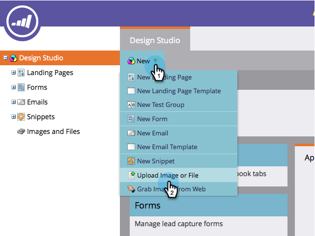
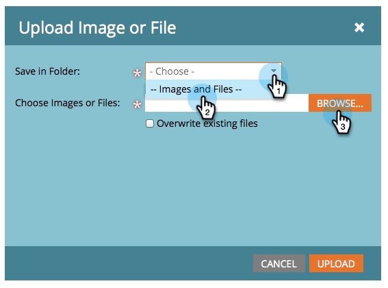
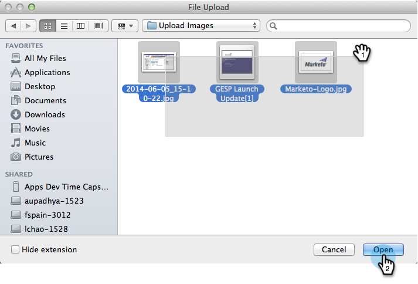
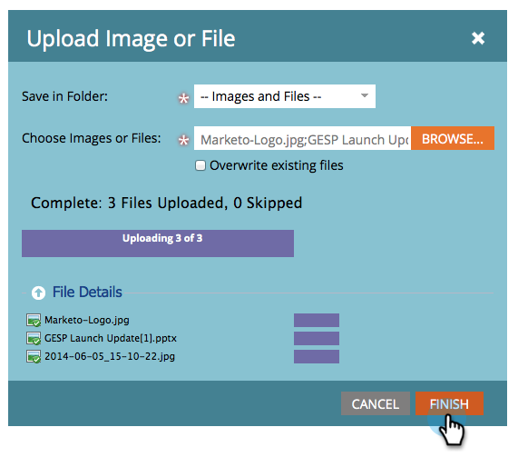
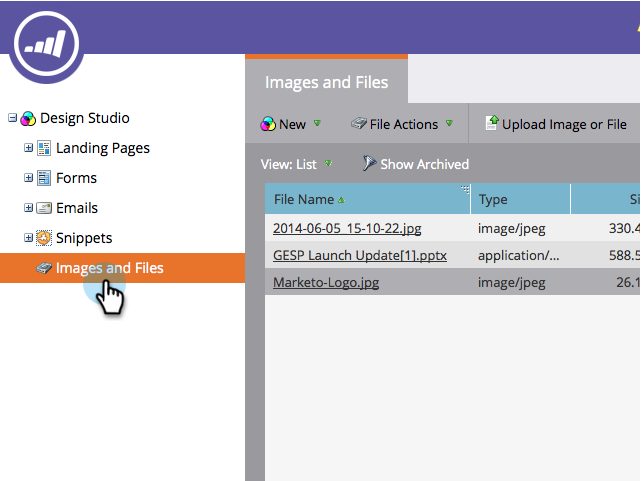

# Add Images and Files to Marketo {#add-images-and-files-to-marketo}

Add Images and Files to Marketo - Marketo Docs - Product Documentation

It's easy to add multiple images and files all at once.

1. Go to the **Design** **Studio**.

   

1. Under **New**, click** Upload Image** **or** **File**.

   

1. Select the folder where you want to store the images or files, then click **Browse**.

   

   >[!NOTE]
   >
   >The maximum size per file is 100MB.

1. To add multiple images and files, browse to the correct folder on your computer, press **Ctrl/Cmd** and click on each file you want to add, then click **Open**.

   

1. Expand the **File Details** to verify you selected the correct images, then click **Upload**.

   

   >[!NOTE]
   >
   >**Reminder**
   >
   >
   >To remove any queued files before upload, click the x next to the file name.

   >[!TIP]
   >
   >Marketo will scan all files before uploading; infected files will be skipped.

   ##### When the upload completes, click Finish. {#addimagesandfilestomarketo-whentheuploadcompletes-clickfinish}

   

1. Your images are now available to use in campaign emails and landing pages.

   

Nicely done!

>[!NOTE]
>
>While Marketo accepts all file types for upload, only the major image types (JPG, PNG, GIF, etc.) will work in our email editor.

#### Watch a Video {#addimagesandfilestomarketo-watchavideo}

`<iframe width="630" height="470" src="//play.vidyard.com/ZWBeQ5oiXRKG2QAP5E7g6Q.html?v=3.1.1" frameborder="0" allowfullscreen></iframe>`  

>[!NOTE]
>
>**Related Articles**
>
>* [Organize Your Images and Files Using Folders](organize-your-images-and-files-using-folders.md)
>

