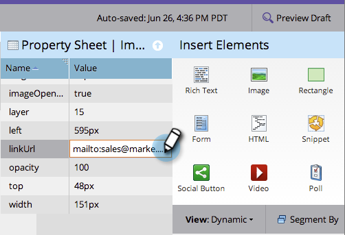

# Add a Link to a Free-Form Landing Page Image {#add-a-link-to-a-free-form-landing-page-image}

Add a Link to a Free-Form Landing Page Image - Marketo Docs - Product Documentation

>[!NOTE]
>
>**Prerequisites**
>
>* [Add an Image to a Free-Form Landing Page](add-an-image-to-a-free-form-landing-page.md)
>

>[!NOTE]
>
>This applies only to free-form landing pages.

1. Select the image you added to your landing page and expand the **Property Sheet.**

   

1. Type your mailto link in the **Link URL.**

   

   Great work! You now have an image as a mailto link on your Marketo landing page.

   

