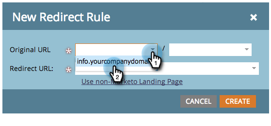

# Redirect a Marketo Landing Page to Another Page {#redirect-a-marketo-landing-page-to-another-page}

Redirect a Marketo Landing Page to Another Page - Marketo Docs - Product Documentation

If you ever update a page's URL and want the old URL to still work, try a redirect! Setting it up is easy.

>[!NOTE]
>
>**Admin Permissions Required**

1. Under **Admin**, click **Landing** **Pages**.

   

1. Under the **Rules** tab, click **New** and then **New** **Redirect** **Rule**.

   

1. Click the **first** **Original** **URL** drop-down and select your Marketo [CNAME](customize-your-landing-page-urls-with-a-cname.md).

   

   >[!NOTE]
   >
   >**Reminder**
   >
   >
   >Remember, you can only redirect URLs that start with your Marketo [CNAME](customize-your-landing-page-urls-with-a-cname.md).

1. Choose the landing page you want to redirect in the **second Original URL** field.

   

   >[!NOTE]
   >
   >You can enter any URL path, even if the page or directory doesn't exist.

1. Click the **Redirect** **URL** drop-down and select the page you want to redirect visitors to.

   

1. Click **Create**.

   

   >[!TIP]
   >
   >To redirect to a web page outside of Marketo, click **Use non-Marketo Landing Page**.

   >[!NOTE]
   >
   >**Related Articles**
   >
   >    
   >    
   >    * [Redirect a URL Path](../../../../../welcome-to-marketo-docs/product-docs/demand-generation/landing-pages/personalizing-landing-pages/redirect-a-url-path.md)
   >    
   >

Kick up your heels, Marketing Hero, you're done! 