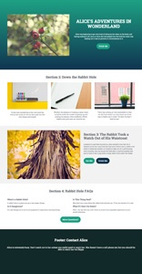
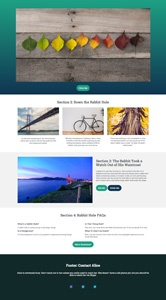
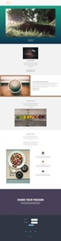
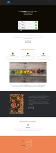
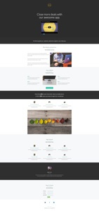
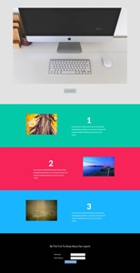
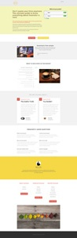
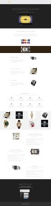
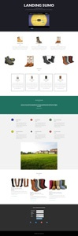
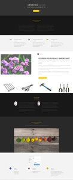

# Guided Landing Page Templates {#guided-landing-page-templates}

Guided Landing Page Templates - Marketo Docs - Product Documentation

Browse our collection of example templates, for use with the [Guided Landing Page Editor](../../../../../welcome-to-marketo-docs/product-docs/demand-generation/landing-pages/guided-landing-pages/create-a-guided-landing-page.md). Each template is fully responsive and based off of the Bootstrap framework.

>[!NOTE]
>
>Marketo Support is not set up to assist with troubleshooting HTML. If you need assistance modifying any of these templates, please consult a web developer.

To import a template into Marketo:

1. Click on the name of the template for larger view.
1. Download the template chosen.
1. In Marketo, navigate to the **Design Studio.**
1. Click **Landing Pages** in the left-hand tree, then select **Templates.**

1. In the menu bar, click **Import Template.**
1. Choose the downloaded file, enter a template name, then click **Import** (make sure to pick a descriptive name and indicate that editing mode is **Guided**).

|   |  |  |
|---|---|---|
| [Template 1-A](guided-landing-page-templates/template-1-a.md) | [Template 1-B](guided-landing-page-templates/template-1-b.md) | [Template 1-C](guided-landing-page-templates/template-1-c.md) |
| 

| 

| 

|
| [Template 1-D](guided-landing-page-templates/template-1-d.md) | [Template 1-E](guided-landing-page-templates/template-1-e.md) | [Template 1-F](guided-landing-page-templates/template-1-f.md) |
| 

| 

| 

|
| [Template 2-A](guided-landing-page-templates/template-2-a.md) | [Template 2-B](guided-landing-page-templates/template-2-b.md) | [Template 2-C](guided-landing-page-templates/template-2-c.md) |
| 

| 

| 

|
| [Template 2-D](guided-landing-page-templates/template-2-d.md) | [Template 3-A](guided-landing-page-templates/template-3-a.md) | [Template 3-B](guided-landing-page-templates/template-3-b.md) |
| 

| 

| 

|
| [Template 3-C](guided-landing-page-templates/template-3-c.md) | [Template 3-D](guided-landing-page-templates/template-3-d.md) | [Template 4-A](guided-landing-page-templates/template-4-a.md) |
| 

| 

| 

|
| [Template 4-B](guided-landing-page-templates/template-4-b.md) | [Template 4-C](guided-landing-page-templates/template-4-c.md) | [Template 5-A](guided-landing-page-templates/template-5-a.md) |
| 

| 

| 

|
| [Template 5-B](guided-landing-page-templates/template-5-b.md) | [Template 5-C](guided-landing-page-templates/template-5-c.md) | [Template 5-D](guided-landing-page-templates/template-5-d.md) |
| 

| 

| 

|
| [Template 5-E](guided-landing-page-templates/template-5-e.md) | [Template 6-A](guided-landing-page-templates/template-6-a.md) | [Template 6-B](guided-landing-page-templates/template-6-b.md) |
| 

| 

| 

|
| [Template 6-C](guided-landing-page-templates/template-6-c.md) | [Template 6-D](guided-landing-page-templates/template-6-d.md) | [Template 6-E](guided-landing-page-templates/template-6-e.md) |
| 

| 

| 

|
| [Template 7-A](guided-landing-page-templates/template-7-a.md) | [Template 7-B](guided-landing-page-templates/template-7-b.md) | [Template 7-C](guided-landing-page-templates/template-7-c.md) |
| 

| 

| 

|
| [Template 7-D](guided-landing-page-templates/template-7-d.md) | [Template 7-E](guided-landing-page-templates/template-7-e.md) | [Template 7-F](guided-landing-page-templates/template-7-f.md) |
| 

| 

| 

|
| [Template 8-A](guided-landing-page-templates/template-8-a.md) | [Template 8-B](guided-landing-page-templates/template-8-b.md) | [Template 8-C](guided-landing-page-templates/template-8-c.md) |
| 

| 

| 

|
| [Template 8-D](guided-landing-page-templates/template-8-d.md) | [Template 8-E](guided-landing-page-templates/template-8-e.md) | [Template 8-F](guided-landing-page-templates/template-8-f.md) |
| 

| 

| 

|
| [Template 8-G](guided-landing-page-templates/template-8-g.md) | [Template 9-A](guided-landing-page-templates/template-9-a.md) | [Template 9-B](guided-landing-page-templates/template-9-b.md) |
| 

| 

| 

|
| [Template 9-C](guided-landing-page-templates/template-9-c.md) | [Template 9-D](guided-landing-page-templates/template-9-d.md) | [Template 9-E](guided-landing-page-templates/template-9-e.md) |
| 

| 

| 

|
| [Template 9-F](guided-landing-page-templates/template-9-f.md) | [Template 10-A](guided-landing-page-templates/template-10-a.md) | [Template 10-B](guided-landing-page-templates/template-10-b.md) |
| 

| 

| 

|
| [Template 10-C](guided-landing-page-templates/template-10-c.md) | [Template 10-D](guided-landing-page-templates/template-10-d.md) | [Template 10-E](guided-landing-page-templates/template-10-e.md) |
| 

| 

| 

|
| [Template 10-F](guided-landing-page-templates/template-10-f.md) | [Template 11-A](guided-landing-page-templates/template-11-a.md) | [Template 11-B](guided-landing-page-templates/template-11-b.md) |
| 

| 

| 

|
| [Template 11-C](guided-landing-page-templates/template-11-c.md) | [Template 11-D](guided-landing-page-templates/template-11-d.md) | [Template 11-E](guided-landing-page-templates/template-11-e.md) |
| 

| 

| 

|
| [Template 11-F](guided-landing-page-templates/template-11-f.md) | [Template 12-A](guided-landing-page-templates/template-12-a.md) | [Template 12-B](guided-landing-page-templates/template-12-b.md) |
| 

| 

| 

|
| [Template 12-C](guided-landing-page-templates/template-12-c.md) | [Template 12-D](guided-landing-page-templates/template-12-d.md) | [Template 12-E](guided-landing-page-templates/template-12-e.md) |
| 

| 

| 

|
| [Template 12-F](guided-landing-page-templates/template-12-f.md) | [Template 13-A](guided-landing-page-templates/template-13-a.md) | [Template 13-B](guided-landing-page-templates/template-13-b.md) |
| 

| 

| 

|
| [Template 13-C](guided-landing-page-templates/template-13-c.md) | [Template 13-D](guided-landing-page-templates/template-13-d.md) | [Template 13-E](guided-landing-page-templates/template-13-e.md) |
| 

| 

| 

|
| [Template 14-A](guided-landing-page-templates/template-14-a.md) | [Template 14-B](guided-landing-page-templates/template-14-b.md) | [Template 14-C](guided-landing-page-templates/template-14-c.md) |
| 

| 

| 

|
| [Template 14-D](guided-landing-page-templates/template-14-d.md) | [Template 14-E](guided-landing-page-templates/template-14-e.md) | [Template 15-A](guided-landing-page-templates/template-15-a.md) |
| 

| 

| 

|
| [Template 15-B](guided-landing-page-templates/template-15-b.md) | [Template 15-C](guided-landing-page-templates/template-15-c.md) | [Template 15-D](guided-landing-page-templates/template-15-d.md) |
| 

| 

| 

|
| [Template 15-E](guided-landing-page-templates/template-15-e.md) | [Template 16-A](guided-landing-page-templates/template-16-a.md) | [Template 16-B](guided-landing-page-templates/template-16-b.md) |
| 

| 

| 

|
| [Template 16-C](guided-landing-page-templates/template-16-c.md) | [Template 16-D](guided-landing-page-templates/template-16-d.md) | [Template 16-E](guided-landing-page-templates/template-16-e.md) |
| 

| 

| 

|
| [Template 17-A](guided-landing-page-templates/template-17-a.md) | [Template 17-B](guided-landing-page-templates/template-17-b.md) | [Template 17-C](guided-landing-page-templates/template-17-c.md) |
| 

| 

| 

|
| [Template 17-D](guided-landing-page-templates/template-17-d.md) | [Template 17-E](guided-landing-page-templates/template-17-e.md) | [Template 18-A](guided-landing-page-templates/template-18-a.md) |
| 

| 

| 

|
| [Template 18-B](guided-landing-page-templates/template-18-b.md) | [Template 18-C](guided-landing-page-templates/template-18-c.md) | [Template 18-D](guided-landing-page-templates/template-18-d.md) |
| 

| 

| 

|
| [Template 18-E](guided-landing-page-templates/template-18-e.md) | [Template 19-A](guided-landing-page-templates/template-19-a.md) | [Template 19-B](guided-landing-page-templates/template-19-b.md) |
| 

| 

| 

|
| [Template 19-C](guided-landing-page-templates/template-19-c.md) | [Template 19-D](guided-landing-page-templates/template-19-d.md) | [Template 19-E](guided-landing-page-templates/template-19-e.md) |
| 

| 

| 

|
| [Template 20-A](guided-landing-page-templates/template-20-a.md) | [Template 20-B](guided-landing-page-templates/template-20-b.md) | [Template 20-C](guided-landing-page-templates/template-20-c.md) |
| 

| 

| 

|
| [Template 20-D](guided-landing-page-templates/template-20-d.md) | [Template 20-E](guided-landing-page-templates/template-20-e.md) |  |
| 

| 

|  |

* 
*

** 
**
