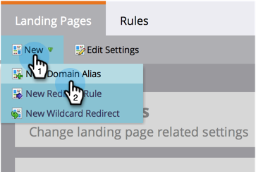
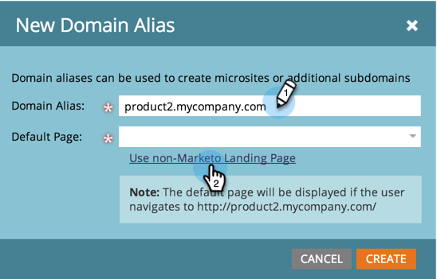

# Add Additional Landing Page CNAMEs {#add-additional-landing-page-cnames}

Add Additional Landing Page CNAMEs - Marketo Docs - Product Documentation

You may want to add landing page CNAMEs to allow different URLs to point to your Marketo landing pages. Following the steps below will help you manage multiple domains.

>[!CAUTION]
>
>Cookies are not shareable across domains.

>[!TIP]
>
>**Same top level domain - Good! Cookies are shared.go**.mycompany.com > **info**.mycompany.com**Different top level domains - Bad! Cookies are not shared.** 
>go.**mycompany**.com > go.**mynewcompany**.com

>[!NOTE]
>
>**Admin Permissions Required**

### What's in this article? {#what-s-in-this-article}

[Find Your Account String](#addadditionallandingpagecnames-findyouraccountstring)  
[Send Request to IT](#addadditionallandingpagecnames-sendrequesttoit)  
[Add a New CNAME](#addadditionallandingpagecnames-addanewcname)

#### Find Your Account String {#addadditionallandingpagecnames-findyouraccountstring}

1. Go to the **Admin** area and click **Landing Pages**.

   

1. Copy the **Account String** from the **Settings** section.

   

1. Make a note of it for the next step.

#### Send Request to IT {#addadditionallandingpagecnames-sendrequesttoit}

1. Ask your IT department to setup the following CNAME: (Replace the word [CNAME] with the CNAME of your choice and [ACCOUNT STRING] with the text from the previous step).

   [CNAME].YourCompany.com > [ACCOUNT STRING].mktoweb.com

#### Add a New CNAME {#addadditionallandingpagecnames-addanewcname}

1. Once your IT department has created the CNAME, go to **Admin** then click **Landing Pages**.

   

1. Click **New** then select **New Domain Alias**.

   

1. Enter your **Domain Alias.** The **Default Page** is displayed if the visitor does not put in a URL. Enter where they should go in that case.

   >[!NOTE]
   >
   >For the Default Page, you can select a landing page or an external URL, such as your public website.

   

1. Enter your **Default Page** and click **Create**.

   

Nice! Now you know what to do if you ever want to add a CNAME.
