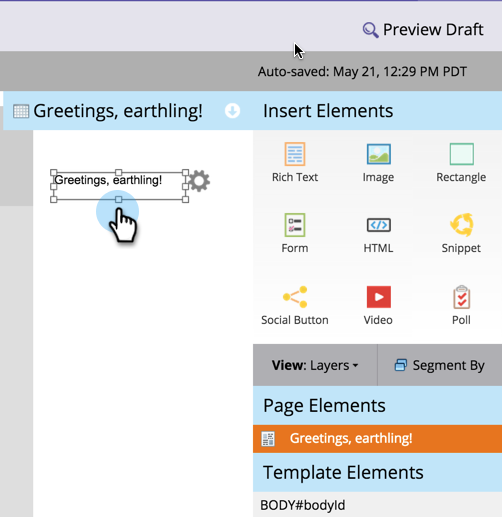
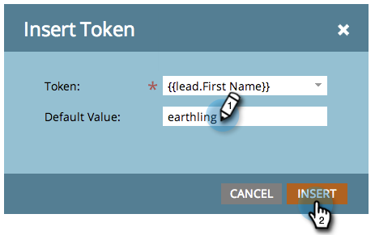

# Add Text and Tokens to a Landing Page {#add-text-and-tokens-to-a-landing-page}

Add Text and Tokens to a Landing Page - Marketo Docs - Product Documentation

### What's in this article? {#what-s-in-this-article}

[Add Rich Text to Your Landing Page](#addtextandtokenstoalandingpage-addrichtexttoyourlandingpage)  
[Add a Token to Your Landing Page](#addtextandtokenstoalandingpage-addatokentoyourlandingpage)

>[!NOTE]
>
>Tokens are only supported in Marketo landing pages.

#### Add Rich Text to Your Landing Page {#addtextandtokenstoalandingpage-addrichtexttoyourlandingpage}

1. Select your landing page and click **Edit Draft**.

   

   >[!NOTE]
   >
   >The landing page designer opens in a new window.

1. Drag over the **Rich Text** element.

   

1. Enter the desired text and click **Save**.

   

Now that you know how to add text to a landing page, let's work on adding a token.

#### Add a Token to Your Landing Page {#addtextandtokenstoalandingpage-addatokentoyourlandingpage}

Tokens are dynamic bits of text that can personalize your landing page.

>[!TIP]
>
>Things like First Name come from the person record. Other tokens come from the My Tokens tab in the program.

1. Select your landing page and click **Edit Draft**.

   

   >[!NOTE]
   >
   >The landing page designer opens in a new window.

1. Double click the rich text box you want to add the token to.

   

1. Click on the Insert Token icon.

   

1. Find and select the token of your choice.

   

1. Enter a **Default Value** and click **Insert**.

   

1. Click **Save**.

   

   Mission Complete! You now have a token on your landing page.

