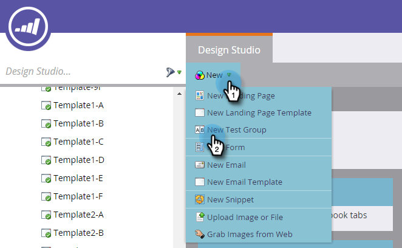
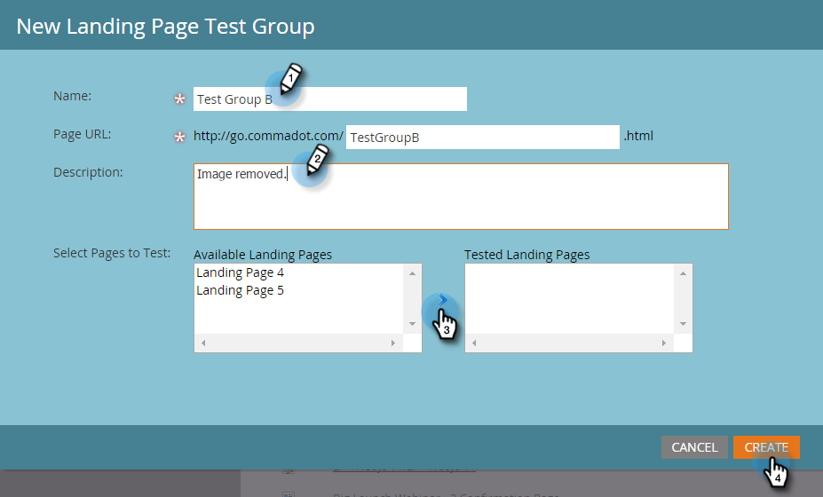
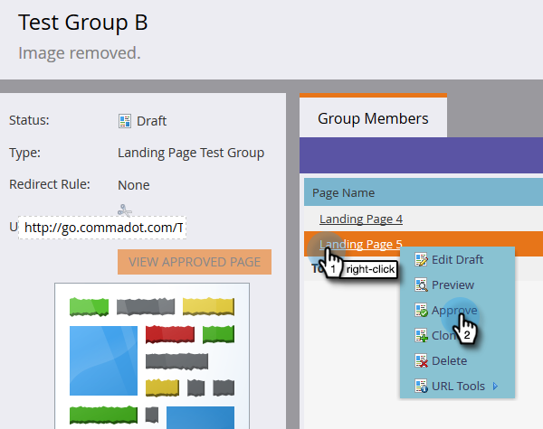
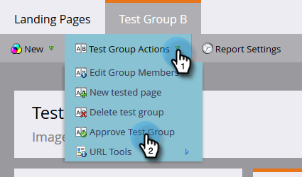

# Landing Page Test Groups {#landing-page-test-groups}

Landing Page Test Groups - Marketo Docs - Product Documentation

Marketo tracks the number of page views and form completions on each tested page within a Test Group. You can use test group results to decide which Landing Page is the most compelling. Here's how to create a test group.

>[!NOTE]
>
>**Prerequisites**
>
>[Build two or more landing pages](../../../../../welcome-to-marketo-docs/getting-started/quick-wins/landing-page-with-a-form.md), preferably with a form.

1. In the Design Studio, click **New**. In the dropdown, select **New Test Group**.

   

   >[!NOTE]
   >
   >The other ways to create a Test Group are:
   >
   >    
   >    
   >    * Right-click a landing page in the tree and select **Convert to Test Group**
   >    * Create a Landing Page Test Group in a program by choosing **AB Test Group** in the **New Local Asset** menu
   >    
   >    
   >

1. Enter a name and an optional description. Select the Landing Pages you want to test and click **Create**.

   

   >[!NOTE]
   >
   >Only unapproved Landing Pages will be available to choose.

1. Right-click on each Landing Page and select **Approve**.

   

1. Click the **Test Group Options** dropdown and select **Approve Test Group**.

   

   That's it! You will now be able to compare stats of your selected Landing Pages.

   

   >[!TIP]
   >
   >If you ever want to delete the Test Group, simply click **Test Group Actions** and select **Delete test group**.

