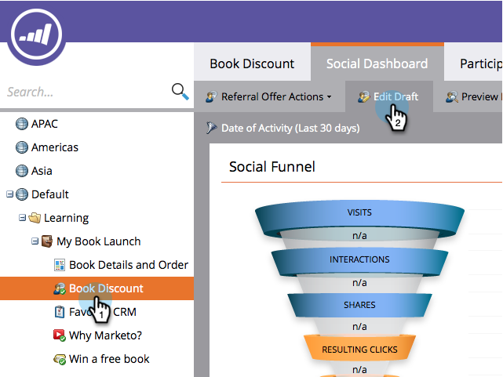
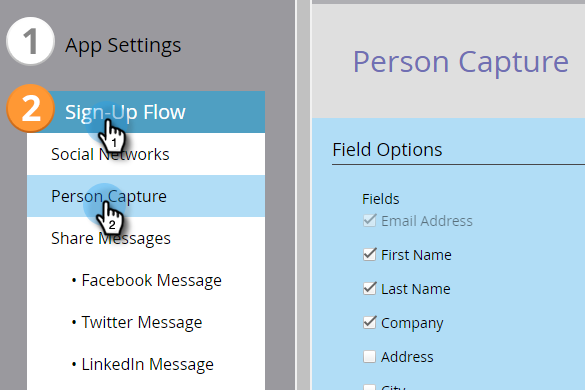
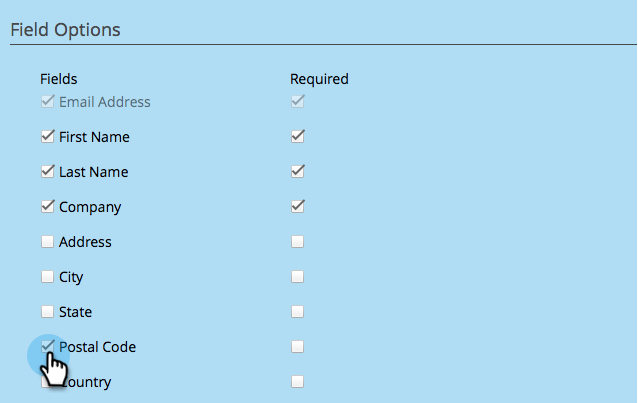
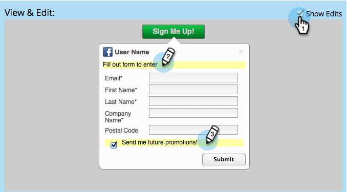

# Configure Person Capture for a Social App {#configure-person-capture-for-a-social-app}

Configure Person Capture for a Social App - Marketo Docs - Product Documentation

When you create a [referral offer](../../../../../welcome-to-marketo-docs/product-docs/demand-generation/social/referral-offers/create-a-referral-offer.md) or a [sweepstakes](../../../../../welcome-to-marketo-docs/product-docs/demand-generation/social/sweepstakes/create-sweepstakes.md), you can configure what information you request and what information you require from people in order to participate.

>[!NOTE]
>
>**FYI**
>
>Marketo is now standardizing language across all subscriptions, so you may see lead/leads in your subscription and person/people in docs.marketo.com. These terms mean the same thing; it does not affect article instructions. There are some other changes, too. [Learn more](http://docs.marketo.com/display/DOCS/Updates+to+Marketo+Terminology).

>[!NOTE]
>
>People are only prompted for this information if they have not provided it previously.

1. Go to **Marketing Activities**. 

   

1. Select the app, and click **Edit Draft.**

   

1. In the social app editor, go to **Sign-Up Flow** > **Person Capture.**

   

1. Select the information you will request, and indicate the fields that are specifically required to sign up for your offer.

   

   Include Marketing options:

    * **Opt Out**: Person is subscribed by default.
    * **Opt In**: Person can choose to subscribe.

   >[!NOTE]
   >
   >Either way, participants will still receive the [*operational* emails](../../../../../welcome-to-marketo-docs/product-docs/email-marketing/general/functions-in-the-editor/make-an-email-operational.md) from your offer.

1. In the View & Edit window, click **Show Edits** and edit the messages in the share prompt.

   

>[!NOTE]
>
>**Related Articles**
>
>Now you can [configure the social sign-up flow](configure-social-sign-up-share-flow.md) and edit the share messages that will be posted to each social network.

