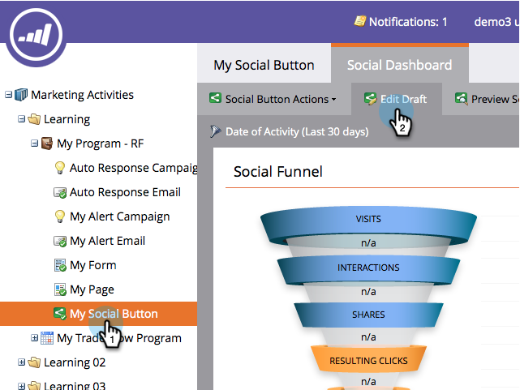
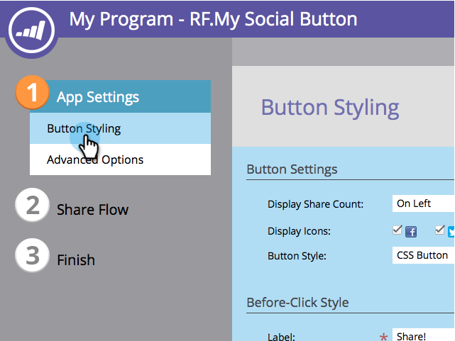
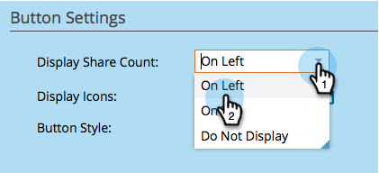
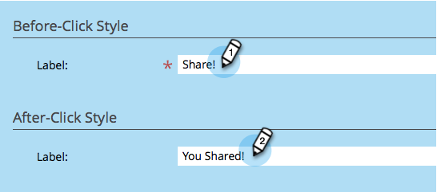

# Customize Social App Button {#customize-social-app-button}

Customize Social App Button - Marketo Docs - Product Documentation

When you create a [social button](../../../../../welcome-to-marketo-docs/product-docs/demand-generation/landing-pages/free-form-landing-pages/add-a-social-button-to-a-free-form-landing-page.md) or a [referral offer](../../../../../welcome-to-marketo-docs/product-docs/demand-generation/social/referral-offers/create-a-referral-offer.md), you can customize the appearance of the buttons.

1. Go to **Marketing Activities**.

   

1. Select the app, and click **Edit Draft.**

   

1. In the social app editor, go to **App Settings** > **Button Styling** (or **Sign-Up Style,** for referral offers).

   

1. Choose where to display the share count or not to display it at all.

   

1. Select which social network icons to display with their corresponding buttons.

   

   >[!NOTE]
   >
   >For referral offers, select your networks under **2. Sign-Up Flow > Social Networks**.

1. Choose a button type.

   

   >[!TIP]
   >
   >If you chose **Upload Images under Button Style** above, the following sections allow you to upload button images instead of editing the text.

1. Edit the labels for the button, before and after being clicked.

   

1. As you make each choice, review the result in the **View & Edit** window.

   

>[!NOTE]
>
>In a referral offer, you can also customize the **Track Progress** button. Go to **App Settings** > **Track Progress Style** and follow the same steps as above.

>[!NOTE]
>
>**Related Articles**
>
>For a social button, [configure when it opens](configure-when-social-button-opens.md). For a referral offer, [specify the offer goal](../../../../../welcome-to-marketo-docs/product-docs/demand-generation/social/referral-offers/specify-goal-for-referral-offer.md).

