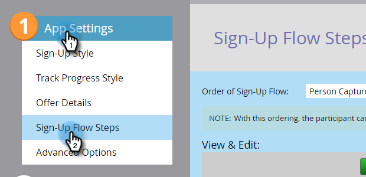
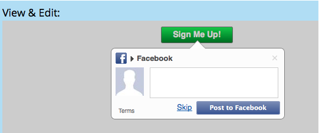

# Set Social Share Requirement {#set-social-share-requirement}

Set Social Share Requirement - Marketo Docs - Product Documentation

When you [create a referral offer](../../../../../welcome-to-marketo-docs/product-docs/demand-generation/social/referral-offers/create-a-referral-offer.md), you can require people to share the offer in order to sign up, or make it optional.

>[!NOTE]
>
>**FYI**
>
>Marketo is now standardizing language across all subscriptions, so you may see lead/leads in your subscription and person/people in docs.marketo.com. These terms mean the same thing; it does not affect article instructions. There are some other changes, too. [Learn more](http://docs.marketo.com/display/DOCS/Updates+to+Marketo+Terminology).

1. Go to **Marketing Activities**.

   

1. Select the referral offer, and click **Edit Draft**.

   

1. In the referral offer editor, go to **App Settings** and then **Sign-Up Flow Steps**.

   

1. Select the order of sign-up flow.

   

    * **Person Capture > Share**: Person can skip sharing and just sign up.
    * **Share > Person Capture**: Person must share in order to sign up.

1. For each option, see the preview in the **View & Edit** window.

   

