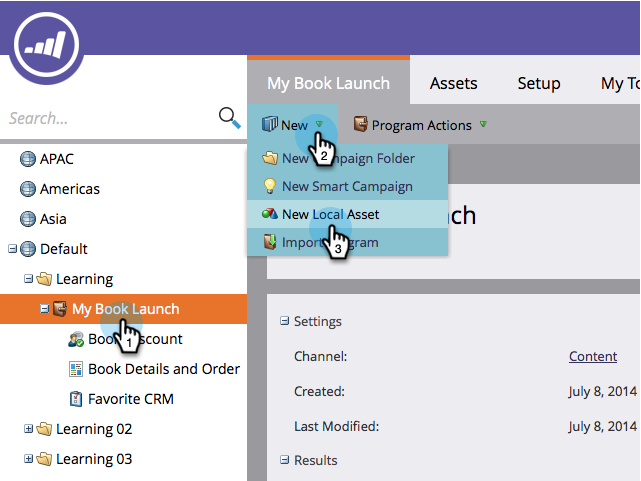
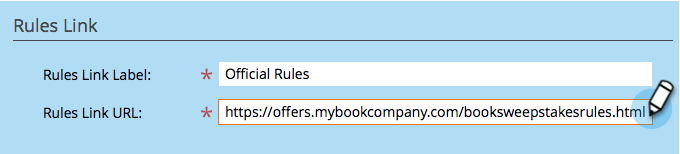

# Create Sweepstakes {#create-sweepstakes}

Create Sweepstakes - Marketo Docs - Product Documentation

A sweepstakes gives people a chance to win a prize in return for telling their friends about you. You can drop it on landing pages, your website, and even Facebook.

>[!NOTE]
>
>**Availability**
>
>Not all customers have purchased this functionality. Contact your sales rep for details.

1. Inside your program, select **New > New Local Asset**.

   

1. In the Local Asset Gallery, click **Sweepstakes**.

   

1. Name your sweepstakes.

   

   >[!TIP]
   >
   >To save time, you can use the **Clone From** option to copy all settings from an existing sweepstakes.

1. Click **Sweepstakes** **Details**.

   

1. Select the frequency, the start and end dates, and your time zone.

   

   >[!NOTE]
   >
   >For daily and weekly drawings, the start and end times are fixed at 12am and 11:59pm respectively. For a one-time drawing, you can choose your own start and end times.

1. Click **Advanced** **Options**.

   

1. Add a link to the rules of your sweepstakes. Enter the URL. This link is required.

   

   The link will appear in the bottom of share message screens.

   >[!NOTE]
   >
   >On this screen, you can also add a privacy policy link. See [Add Your Privacy Policy to a Social App](../../../../../welcome-to-marketo-docs/product-docs/demand-generation/social/social-functions/add-your-privacy-policy-to-a-social-app.md).

1. Click **Finish**.

   

1. Click **Approve** **and** **Close**.

   

   >[!TIP]
   >
   >To change any of the defaults in your sweepstakes, click **Back**. To save your work for later without approving, click **Close**.

   Congratulations! You have created a sweepstakes.

   >[!NOTE]
   >
   >**Related Articles**
   >
   >The next step is to [publish your sweepstakes](publish-a-sweepstakes.md), but you can change the appearance and settings of your sweepstakes. Start with [customizing your sweepstakes styles](customize-sweepstakes-styles.md).

The sweepstakes editor opens in a new window. The default settings are all good, but you still need to configure a few details. We’ll show you how in the next steps.                    If there are any problems in the sweepstakes, you will be prompted to address them before the sweepstakes is approved. 