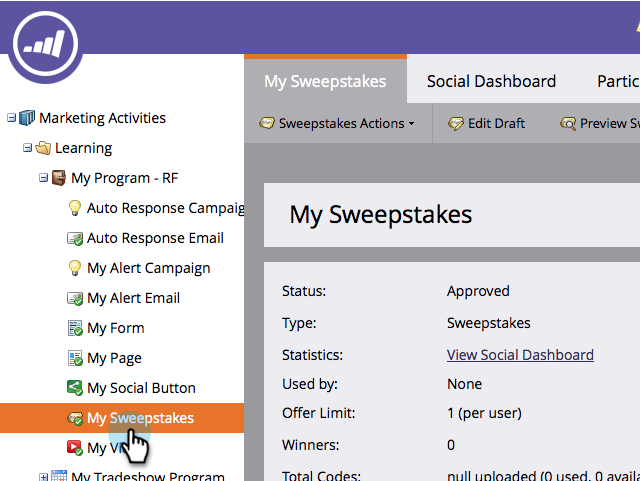
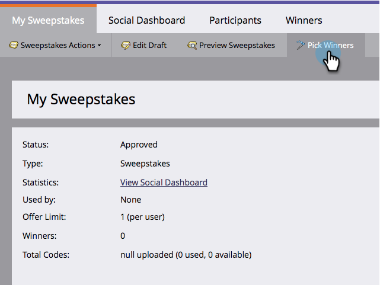
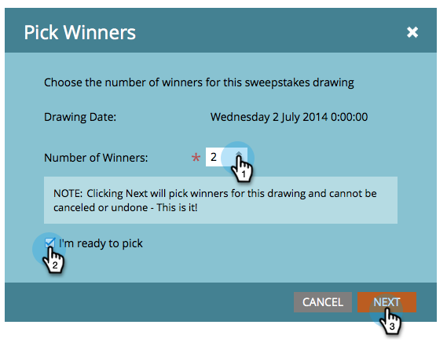
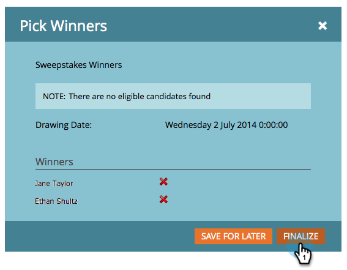

# Select Sweepstakes Winners {#select-sweepstakes-winners}

Select Sweepstakes Winners - Marketo Docs - Product Documentation

When you [publish a sweepstakes](publish-a-sweepstakes.md), you need to select winners for each drawing. When you do, your [fulfillment email](../../../../../welcome-to-marketo-docs/product-docs/demand-generation/social/social-functions/use-emails-in-social-promotions.md) is automatically sent to them.

>[!NOTE]
>
>**Availability**
>
>Not all customers have purchased this functionality. Contact your sales rep for details.

1. Go to **Marketing Activities**.

   

1. Select your sweepstakes.

   

1. Click **Pick** **Winners**.

   

   >[!TIP]
   >
   >To see a list of people who have signed up for your sweepstakes, click the **Participants **tab.

1. Choose the number of winners, select **I'm ready to pick**, and click **Next**.

   

   >[!NOTE]
   >
   >If you choose 0 winners for a particular drawing, that information is not displayed on the **Winners** tab.

1. Click **Finalize** to send the [fulfillment email](https://community.marketo.com/MarketoArticle?id=kA050000000L8A6) to the listed winners.

   

   >[!NOTE]
   >
   >You can disqualify winners before you click Finalize. If you do, they are still eligible for other drawings in this sweepstakes.

Congratulations! You have completed this run of your sweepstakes offer, picked the random winners, and sent them email notifications. 