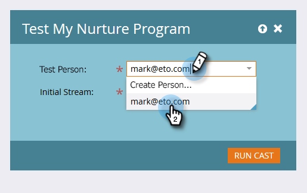

# Test an Engagement Stream {#test-an-engagement-stream}

Test an Engagement Stream - Marketo Docs - Product Documentation

Once you've added all your content to a stream, you can test them out one piece at a time.

>[!NOTE]
>
>**FYI**
>
>Marketo is now standardizing language across all subscriptions, so you may see lead/leads in your subscription and person/people in docs.marketo.com. These terms mean the same thing; it does not affect article instructions. There are some other changes, too. [Learn more](http://docs.marketo.com/display/DOCS/Updates+to+Marketo+Terminology).

1. Go to **Marketing Activities**.

   

1. Select your engagement program.

   

1. Click** Program Actions** and select **Test Stream**.

   

1. Select your person from the **Test Person **drop-down. Remember, content will actually go out, so keep that in mind when choosing.

   

   >[!CAUTION]
   >
   >Make sure that your test person is unique and doesn't have duplicates in the database.

   >[!TIP]
   >
   >If the test person you're looking for doesn't exist, use the **Create Person** option to create one on the fly.

   ##### Click Initial Stream, select the stream you want to test and click Run Cast. {#testanengagementstream-clickinitialstream-selectthestreamyouwanttotestandclickruncast}

   

1. After the person goes through the [transition rules](transition-people-between-engagement-streams.md) you previously set up, click the Refresh icon.

   

1. The new stream will appear, indicating a successful test.

   

   Good work!

   >[!NOTE]
   >
   >No other content will be sent unless you click **Run Cast **again.

