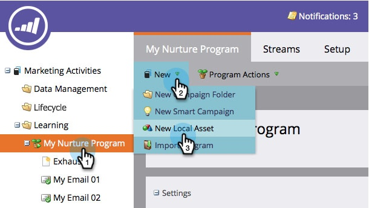

# Engagement Stream Performance Report {#engagement-stream-performance-report}

Engagement Stream Performance Report - Marketo Docs - Product Documentation

Want to know how your engagement content is performing? Try the engagement stream performance report.

### What's in this article? {#what-s-in-this-article}

[Create the Report](#engagementstreamperformancereport-createthereport)  
[Edit Settings](#engagementstreamperformancereport-editsettings)  
[Run Report](#engagementstreamperformancereport-runreport)

#### Create the Report {#engagementstreamperformancereport-createthereport}

1. Find and select your engagement program, then under **New** click **New Local Asset**.

   

1. Select **Report**.

   

   >[!TIP]
   >
   >Creating the report under the program will automatically restrict it to the content of the program.

   ##### Select Engagement Stream Performance as the report Type. {#engagementstreamperformancereport-selectengagementstreamperformanceasthereporttype}

   

1. Name your report and click **Create**.

   

   Alright! Now let's check out the settings.

#### Edit Settings {#engagementstreamperformancereport-editsettings}

1. Find and select your report.

   

1. Under the **Setup** tab, double-click the **Engagement Program Email** filter.

   

1. Select the email(s) you want to report on and click **Apply**.

   

#### Run Report {#engagementstreamperformancereport-runreport}

1. To run the report simply click on the **Report** tab.

   

   >[!TIP]
   >
   >
   >Although not illustrated, Engagement Score is a column in this report. See [Understanding the Engagement Score](understanding-the-engagement-score.md) for details on what it is.

   Great job! Notice that the report is grouped by engagement program.

