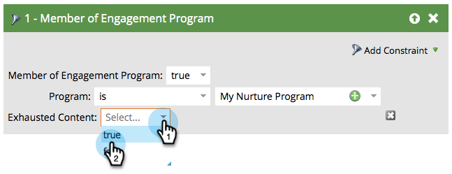

# People Who Have Exhausted Content {#people-who-have-exhausted-content}

People Who Have Exhausted Content - Marketo Docs - Product Documentation

>[!NOTE]
>
>**FYI**
>
>Marketo is now standardizing language across all subscriptions, so you may see lead/leads in your subscription and person/people in docs.marketo.com. These terms mean the same thing; it does not affect article instructions. There are some other changes, too. [Learn more](http://docs.marketo.com/display/DOCS/Updates+to+Marketo+Terminology).

When a person has received every piece of content in a stream, it has exhausted all possibilities and will wait idle until more is added. You can find people that are "exhausted" in several ways.

### What's in this article? {#what-s-in-this-article}

[Member of Engagement Program filter](#peoplewhohaveexhaustedcontent-memberofengagementprogramfilter)  
[Members tab](#peoplewhohaveexhaustedcontent-memberstab)  
[Stream](#peoplewhohaveexhaustedcontent-stream)

#### Member of Engagement Program filter {#peoplewhohaveexhaustedcontent-memberofengagementprogramfilter}

1. Create a new smart list, then find and drag in the **Member of Engagement Program** filter.

   

1. Find and select the engagement program in which to find exhausted people.

   

1. Under **Add Constraint**, select **Exhausted Content**.

   

1. Set **Exhausted Content** to **true**.

   

   Simply run this smart list to see the list of people that have exhausted all content in the stream they are in.

#### Members tab {#peoplewhohaveexhaustedcontent-memberstab}

1. Go to **Marketing Activities**.

   

1. Select your engagement program and go to the **Members** tab.

   

1. Notice the column called **Exhausted Content**.

   

   This shows you people that have exhausted all content and those who have not.

#### Stream {#peoplewhohaveexhaustedcontent-stream}

1. You can also see the total people who have exhausted content under the Streams tab on the stream itself.

   

   >[!NOTE]
   >
   >This number will update immediately after each cast.

