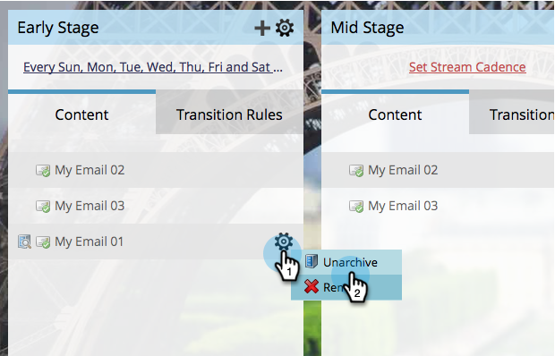

# Archive and Unarchive Stream Content {#archive-and-unarchive-stream-content}

Archive and Unarchive Stream Content - Marketo Docs - Product Documentation

If you no longer want to use a piece of content in a stream you can either [remove](remove-stream-content.md) it or archive it. Here's how to archive content.

### What's in this article? {#what-s-in-this-article}

[Archive Stream Content](#archiveandunarchivestreamcontent-archivestreamcontent)  
[Unarchive Stream Content](#archiveandunarchivestreamcontent-unarchivestreamcontent)

>[!TIP]
>
>Removing destroys all the history associated; archiving preserves it.

#### Archive Stream Content {#archiveandunarchivestreamcontent-archivestreamcontent}

1. Select your engagement program and go to the **Streams** tab.

   

1. Hover over the email you want to archive, then under the gear icon click **Archive**.

   

   That's it! Remember, archive if you want to preserve history.

#### Unarchive Stream Content {#archiveandunarchivestreamcontent-unarchivestreamcontent}

1. Select your engagement program and go to the Streams tab.

   

1. Click on the gear icon for your stream then click on Show archived content.

   

1. Now that you can see the archived content, click the gear icon for the content you want to unarchive, then click **Unarchive**.

   

   Perfect! Now this content is available to be prioritized and activated.

