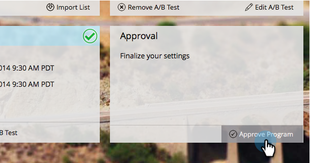

# Approve/Unapprove an Email Program {#approve-unapprove-an-email-program}

Approve/Unapprove an Email Program - Marketo Docs - Product Documentation

>[!NOTE]
>
>**Prerequisites**
>
>* [Create an Email Program](../../../../../welcome-to-marketo-docs/product-docs/email-marketing/email-programs/creating-an-email-program/create-an-email-program.md)
>* [Define an Audience with a Smart List](../../../../../welcome-to-marketo-docs/product-docs/email-marketing/email-programs/managing-people-in-email-programs/define-an-audience-with-a-smart-list.md) or by [Define an Audience by Importing a List](../../../../../welcome-to-marketo-docs/product-docs/email-marketing/email-programs/managing-people-in-email-programs/define-an-audience-by-importing-a-list.md)
>
>* [Choose an Existing Email](choose-an-existing-email.md) or [Create an Email for an Email Program](create-an-email-for-an-email-program.md)
>
>* [Schedule Your Email Program](schedule-your-email-program.md)
>

### What's in this article? {#what-s-in-this-article}

[Approve your Email Program](#approve-unapproveanemailprogram-approveyouremailprogram)  
[Unapprove your Email Program](#approve-unapproveanemailprogram-unapproveyouremailprogram)

#### Approve your Email Program {#approve-unapproveanemailprogram-approveyouremailprogram}

Now that your program is ready to go, the final step is to approve it. Here is how:

1. Go to **Marketing Activities**.

   

   ##### Select your email program. {#approve-unapproveanemailprogram-selectyouremailprogram}

   

   >[!CAUTION]
   >
   >If you don't approve your email program, the email will not go out.

1. Under the **Approval** tile go ahead and click on **Approve Program**.

   

1. If we find issues, we'll let you know - fix them and try approving again.

   

   Perfect! You're done. Your email will go out at the scheduled time.

   

#### Unapprove your Email Program {#approve-unapproveanemailprogram-unapproveyouremailprogram}

If you change your mind and decide you don't want it to go out, you can unapprove the email program.

1. Go to **Marketing Activities**.

   

1. Select your email program.

   

1. Under the **Approval** tile, simply click on **Unapprove Program**.

   

Done and done! Your email won't go out until you approve it again.
